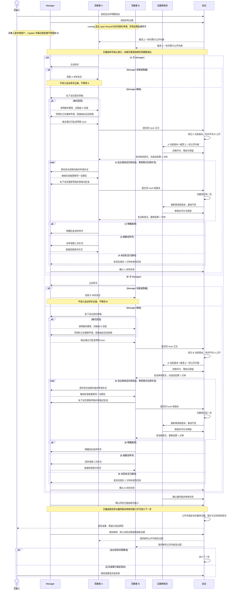

# Meeting Evidence Round Requirements

状态：已确认的目标业务流程；2026-09-15 用户逐项确认轮次、证据包、角色分工、可见性、审核上下文、补充上限与响应期限；2026-09-16 又确认 Manager 独立驳回格式不合格的私有材料、同任务重新申请并说明补正内容、会议运行期间无轮次申请排队及 Transcript 通知。本文定义目标业务验收，不声明实现覆盖。

## Purpose

让不同贡献者在同一议题轮次独立取证，由 Manager 管理参与与证据提交要素，由独立证据审核员评价内容，并在轮次收口后公开最终证据、审核意见及下一步议题。轮次确认的是证据与审核状态，不要求贡献者对评分、解释或结论意见一致。

## Scope

适用于召集人、Manager、贡献者、证据审核员和会议在一个证据轮次中的举手、取证、提交、补正、审核、补充、退出、公开与议题规划。A、B 是两个可并行工作的贡献者示例；收口规则适用于每位已获接纳的贡献者，证据与审核规则适用于其中实际提交证据者。

## Non-goals

- Manager 只审核格式、必备要素、引用定位与可访问性说明，不判断证据内容真实性、可信度或观点支撑度；格式驳回是独立处置动作，私有旧材料由贡献者自行保存，不成为 Meeting 证据事实。
- 不由证据审核员否认会议已经登记某份证据、决定贡献者能否发言、接纳正式成果或代替召集人结束会议。
- 不以贡献者人数、参考资料数量、同一来源的重复引用或评分总和自动证明观点或会议目标成立。
- 本文不选择数据库、文件目录、通信机制、上传形态、包大小或 DSH 接入方式；证据包没有预设的业务资料项数上限，跨边界容量及失败语义仍须在接口契约中确定。

## Functional Requirements

### ER-FR-1：轮次计划、公开基线与角色

1. 召集人是发起并控制会议的本地用户，不等同于 Captain Agent；召集人确定会议目标，Manager 规划当前议题。进入下一轮时，贡献者可看到截至上一轮结束时已经公开的累计会议内容，并据此判断是否举手。需要 Captain 专属结构化权限的操作仍由 Captain 执行，不因召集人在时序图中出现而转授给本地用户或 Manager。
2. 每轮开始时固定截至上一轮的公开内容与最终证据版本。审核本轮一份证据时，只使用该固定累计公开基线及当前待审证据版本；不使用本轮其他贡献者的证据，无论后者提交或审核得更早。
3. A、B 可以并行举手、取证、提交和接受反馈。提交先后不扩大任一人的本轮可见范围，也不改变另一人的审核基线。证据审核员可逐份处理，不要求同时审核。
4. Manager 只在本轮所有已接纳的举手及最终证据审核均已收口后规划继续、停止当前议题或下一议题；下一议题可以专门质疑某份已公开证据。Manager 可选择已有授权议题中的下一步；若需把新议题 candidate 纳入正式议程，只提出计划和理由，仍由 Captain 按会议议程权限处置。正常议题规划不在已接纳提交或审核在途时停止当前议题；强制结束、取消及预算耗尽属于异常终止边界，须保留未完成项和原因。召集人接收并判断会议成果或决定结束整场会议，但正式目标完成仍按会议完成条件与授权操作判断，Manager 不代替该接受。

### ER-FR-2：举手与 Manager 安排

1. 贡献者主动向 Manager 举手，说明拟推进的当前问题及取证准备。Manager 可以安排其参与，或以“暂缓／拒绝”拒绝其本轮发言；此处“暂缓”不产生等待中的本轮发言资格。
2. 举手在 Manager 处置前必须可定位和恢复；处置完成后，被拒绝或暂缓者不参与本轮对话，Manager 向本人返回理由，会议不保留该次待处置举手或 Contribution，也不因其未回复而等待轮次收口。命令审计可保留申请与处置事实，但不得把它投影为已接纳参与。Manager 可以依据当前议题安排人选，但不得用该安排预判尚未提交证据的内容真伪。
3. 获得安排后，贡献者准备证据并提交给 Manager。已接纳的举手从接纳时起属于本轮待收口参与，即使尚无证据包；Manager 等待对应证据，本人未主动选定和提交的私有取证材料不进入会议。若准备任务的适用期限届满或该身份不可用且仍未提交，记录为“未提交退出”及原因，不生成空证据包，不把该身份所需证据判为已满足；其他贡献者可继续工作。
4. 会议进入 running 后，没有 open Round 时，合格贡献者仍可就当前 active Agenda 申请取证机会，说明拟处理的问题；申请持久排队，不自动开轮或取得 Contribution。Manager 开轮后再接纳、拒绝或暂缓该举手。已有未结束贡献或任务的身份不能提出新的贡献申请；在原未结束 Contribution 内说明补证内容的重新申请不算第二项任务。

### ER-FR-3：每人每轮唯一证据包及格式

1. 一位贡献者在一轮中最多拥有一份会议证据包，使用稳定标识和当前版本。首次格式获批后提交才创建该包；未获批的私有草稿与格式补正由贡献者自己保留，不在会议中形成包或版本。获批后的实质补充更新同一包，不新增第二份会议证据。会议只展示和引用该人该轮的一份当前有效证据包，旧审核须能追溯到所针对的版本。
2. 证据包由一份说明文件和一组参考资料构成。说明文件至少列明：证据包标识、轮次、贡献者、版本、所回应的议题或具体观点、直接观察、提交者的解释与推断、获取或核验方法、可观察的反证条件、不确定性与适用限制、以及参考资料 ID 与引用位置。直接观察不得和推断混写；若说明文件承载本轮公开论证，其主张、证据、推断、反证条件和不确定性同时符合会议公共论证格式，不另造第二份会议证据包。
3. 每项参考资料至少列明：资料 ID、类型、原始作者或机构及原始出处、来源发布日期与取得／观察时间（适用时）、可固定或核对的资料版本、可访问内容或定位、具体页段／表格／代码／数据位置、取得及复核条件、已知限制、与其他资料共享的来源或数据依赖。转载与原始资料、多人引用与独立核验必须区分；未知项标“未知”，不适用项写明原因，不为了填齐要素编造事实。
4. 一个证据包可以包含多项不同类型的参考资料；“一份”约束的是同一贡献者同一轮的会议证据记录，不把多项附件误计为多份会议证据。引用某一具体观点时须指出所用资料、位置及推断关系；同一资料对不同观点的支撑度可以不同。

### ER-FR-4：要素确认、登记与轮内可见性

1. Manager 只核对说明文件和参考资料清单的格式、必备要素、引用定位与可访问性说明；通过独立的私有草稿格式审核动作可以批准、驳回并要求补正，或暂缓。Manager 不能质疑材料内容是否真实、观察是否可信、观点是否被充分支撑，或改写贡献者提交的内容。要素未知但明确标记时不得要求编造确定值；“暂缓／驳回”只使该次私有提交继续处于要素补正阶段，不把已接纳举手当作初次举手遭拒或已完成轮次。
2. 格式获批后，作者提交与获批草稿一致的内容，初次证据包与完整登记事实才原子进入会议。作者、Manager、证据审核员和会议可处理该轮证据；本轮其他贡献者在轮次结束前不能读取该证据包或其审核意见。因此 B 的本轮准备及审核不能交叉引用 A 本轮的证据。
3. 证据进入会议只确认当前版本已登记，不等于已核验或全员公开。本轮贡献者围绕该包形成的待公开论证正文也不得在轮次收口前向其他贡献者发布；格式／正文边界确认不提前改变本轮固定公开基线。轮次收口后，会议公开该轮每位贡献者的一份最终证据包、相关论证正文及其审核意见，成为下一轮累计公开基线；旧版本对应的审核不自动成为新版本的审核。
4. 贡献者保存并送交 Manager 的材料，在格式审核通过前只属于该贡献者的私有材料，不是 Meeting EvidencePackage、EvidenceVersion、Registration 或 EvidenceReview。Manager 通过独立格式审核动作接纳、驳回并要求补正，或暂缓；驳回必须向本人说明缺失要素，不能登记旧材料进入会议，旧材料由贡献者自行保存。作者在原未结束任务内重新申请并用文字说明补正内容，获得 Manager 接纳后再送交格式审核；这类未登记材料的反复提交属于格式补正，不消耗两次实质补充机会。

### Evidence Source And Code Materials

- 多人引用同一原始材料只形成一个来源，不因引用人数或转载链接增加独立验证次数。不同分析可分别保留，但声称独立核验时须说明实际方法、材料、观察结果及与既有验证共享的数据或依赖；无法判断独立性时标为未核实。审核员评价来源独立性，Manager 整合方案时不得把重复引用或多人赞同当作证据增强。
- 代码参考资料须能定位同一固定版本及主张所指的调用路径。记录仓库来源与固定 commit；未提交修改须附相对该基线的 diff 及核验所需新文件内容。无 Git 基线时记录可定位快照，不以会漂移的分支名或工作目录代替固定版本。引用提供文件、函数或符号、版本绑定的位置及影响判断的调用方、配置和依赖；同一固定基线可复用，不强制重复复制仓库。
- 声称运行验证时，提供脚本、实际命令、环境和依赖版本、输入、预期与实际输出、覆盖和未覆盖范围，绑定所验证的代码版本。未运行须标明静态分析；作者的运行结果与审核员独立复现分别记录，阅读输出不等于复现。无法访问、无法复现或缺少依赖时记录原因，不推断为通过，也不因此扩大权限。
- 仅有“已查阅”“测试通过”、不可访问链接或本机路径文字不能代替可供审核的资料内容。定位文字不授予额外文件读取权限；缺失、未知与不可访问范围须如实标注。

### ER-FR-5：独立审核与四维评分

1. 证据审核员对每份已登记证据包的当前版本，结合 ER-FR-1 的固定公开基线评价内容。审核员不能否认会议已登记该证据，但可以质疑原始来源的真实性、观察可靠性、资料独立性、适用范围及具体观点的推断关系。作者不得审核自己的证据。
2. 审核分别记录四维评分和逐项理由，不以一个加总分或人数投票代替判断：

   | 维度 | 判断对象 |
   | --- | --- |
   | 来源 | 原始出处能否追溯，固定版本能否定位，转载及共同数据依赖是否说明。 |
   | 可信度 | 观察或材料内容的可靠性、可核对性，以及与截至上一轮公开证据的相容或冲突。 |
   | 完整性 | 回答该问题所需的资料、方法、条件、上下文和已知限制是否足以审查。 |
   | 观点支撑度 | 指定资料的指定部分对某个具体观点是直接支持、部分支持、不支持，还是无法判断；所需推断假设是否成立。 |

3. 每维使用 0～3 级：0 表示有明确重大缺口或反证，1 表示明显不足，2 表示足以有限判断但有已说明限制，3 表示依据充分且可核对；证据不足以给出数值时另记“无法判断”，不把它当作 0。每项评分须保留审核范围、理由和影响判断的上一轮依据。评分是审核意见，不是 Manager 接纳、观点接受或会议目标完成事实。

### ER-FR-6：审核意见、两次补充与响应

1. 会议将审核意见发给该证据包的贡献者；内部“发送完成”时刻起算 1 分钟响应期限，发送失败不开始计时。贡献者应立即明确回复“继续举手”或“放弃举手”，不以 LLM 流量有无推断其意愿，也不把未回复当作主动放弃。
2. 首次提交不计补充次数；Manager 要求修正格式、定位或缺失要素不计补充次数。证据登记后，每次获接纳的实质性更新计一次，一人一轮最多两次，更新该轮同一证据包。贡献者依据自己获接纳的记录主动判断剩余次数；机会用尽后不再申请本轮证据补充。
3. 作者在同一未结束 Contribution 内可以随时向 Manager 重新申请补证并用文字说明内容；申请与首次举手一样需要 Manager 明确接纳才可提交，审核意见送达不是申请的唯一触发条件。当前已登记版本正由审核员处理时可以申请，但不得修改该证据包；Manager 在审核收口前只可暂缓接纳。获接纳的已登记材料实质更新须重新登记、按相同固定基线重新审核，旧评分不沿用。私有材料的格式驳回及重新送交仍属首次登记前补正，不计实质补充次数。
4. 如果贡献者误判次数、重复或迟到，仍在两次用尽后举手，Manager 直接回复“暂缓／拒绝本轮再次补充”。该申请不被接纳，贡献者不继续本轮补充；已登记的证据和审核意见仍保留，不把拒绝记录成其主动放弃。
5. 对已经提交证据的人，Manager 在收到本人明确回复后确认其轮次状态。响应期限届满而未回复时，Manager 可记录“超时退出本轮”及原因，不冒称本人主动放弃；已登记的证据仍按实际审核结果保留，必要证据缺口不能因超时被推定为已满足。格式补正或最终审核未完成时，按其适用的任务／审核时限等待；超时或发送持续失败时明确报告待处理包、阶段与原因，不能把未审版本当作已审版本公开，也不能无限等待或静默跳过审核。

### ER-FR-7：轮次收口、公开和后续计划

1. 正常收口要求每个已接纳举手都有确定状态：未提交者已提交证据或明确退出／按适用期限记录未提交退出；已提交者已明确放弃／被拒继续补充／超时退出；所有已登记证据的最终版本均完成审核。Manager 确认这些贡献者状态，证据审核员确认最终审核状态，会议才收口并公开本轮证据与审核意见。被格式驳回且未重新提交可登记材料者按适用期限明确退出，不把私有旧材料或空包公开。初次举手遭拒且未获接纳的人不计入收口等待对象。若本轮没有已接纳举手，会议可收口空轮次并由 Manager 重新规划；空轮次不生成证据或完成事实。
2. 完成审核不要求评分为正，也不要求贡献者同意审核意见；负面评分、无法判断和未解决质疑原样公开。它们可成为 Manager 下一轮继续质疑或补证的议题，不得因轮次推进被宣布为事实已证实。
3. Manager 在轮次收口后选择继续、停止当前议题或规划下一议题，说明待解决问题和理由；需要正式接纳新议题 candidate 时遵守 Captain 专属处置边界。会议把新的公开内容提供给贡献者，由贡献者自主判断是否举手。召集人接收轮次成果、退出原因和未解决问题，正式成果满足会议目标时可接受成果；即使未满足，也可按会议控制规则结束并明确部分完成、取消或其他原因，不把结束冒充目标完成。

最终当前版本虽已审核但审核意见仅发送失败时，不可将该轮正常公开为已向作者反馈；须继续可观察地重试或按异常轮次路径报告，不能以作者沉默代替送达。

### ER-FR-8：申请运行机会与 Transcript 通知

1. 会议进入 running 后，合格身份自己的会议专用 DSH Session 已 active 时可以获得一次申请机会；此机会只允许其自行判断是否申请，不授予 Contribution。此后每条新正式 Transcript 内容通知相关且当前没有未结束贡献或任务的身份，使闲置 Participant 取得运行轮次；不要求每次通知都发言，也不唤醒未证明归属或非 active 的 Session。
2. 通知携带可核对的会议、议题和已公开内容标识，Agent 通过受控读取取得 caller-visible 内容；通知不得携带本轮他人未公开证据、私有 Session 历史或隐藏推理。投递成功、Agent 执行完成、举手获接纳和证据提交是不同结果。通知失败须可重试并可观察，不能产生空 Contribution 或把未响应推定为放弃。

## Business Rules

- 轮内材料登记、审核和轮末公开是不同事实；“进入会议”不等于“本轮其他贡献者可见”。此前“`save_evidence` 后选定材料立即对全体参会者公开”的目标口径被本规则取代。
- 证据内容审核属于独立审核员，Manager 的格式及要素确认不产生可信度或观点支撑评分；审核员对来源真伪的质疑不抹除会议已经登记该证据的事实。
- 轮次的推进确认的是提交者状态与最终版本审核状态，不要求评分一致或观点一致；正式成果和目标完成仍须按其自身条件判断。
- 截至上一轮的公开内容是累计基线；只看紧邻上一轮而丢弃更早公开内容，或把本轮其他证据纳入审核，均不符合本规则。

## Business Sequence

## Acceptance Criteria

1. A、B 同轮独立提交时，B 在轮末公开前读不到 A 的轮内证据及审核意见；两份审核都使用同一截至上一轮的固定累计公开基线，先后顺序不改变审核输入。
2. Manager 拒绝 A 初次举手时，A 收到拒绝，本轮会议没有 A 的举手或证据记录，也不因 A 不回复而等待；B 的有效贡献仍能继续。若 A 已获接纳但到适用期限仍未提交，则明确记录未提交退出，轮次不提前忽略 A，也不生成空证据包。
3. 私有草稿第一次被格式驳回时，Meeting 不存在该草稿的 EvidencePackage、EvidenceVersion、Registration 或 Review；作者自己保留旧稿，重新申请并文字说明补正，获批后同一提交动作才创建首份会议证据包。格式补正不消耗机会；后来最多两次获接纳实质补充只更新这一包，第三次申请拒绝，新版本重新审核且旧评分不冒充新评分。
4. Manager 的独立格式审核能指出缺失的说明文件或资料清单要素，不能据内容可信度或观点支撑度退回；审核员只对已登记版本分别给出来源、可信度、完整性及具体观点支撑度的数值或无法判断与理由，不因来源疑点删除登记事实。
5. 审核意见内部发送完成后，贡献者 1 分钟内明确举手或放弃；发送失败不启动期限。无回复只产生可区分的超时退出，不能标成主动放弃或已充分核验。
6. Manager 只能在所有已接纳举手及最终审核均收口后决定议题继续、停止或下个问题；轮末公开后 A、B 才能读取彼此本轮的最终证据、相关论证和意见。负面审核可成为下一轮的质疑议题，不要求全员同意评分。新增议题 candidate 须由 Captain 正式处置，Manager 的计划不越权生效。
7. 轮次完成、证据登记、证据审核与正式成果接受可分别观察；某人超时、评分为负或已完成轮次均不自动满足会议目标。
8. 审核员或 Manager 的必要处理逾期、意见持续无法发送时，未审版本不公开，会议显示受阻阶段和原因并交由召集人处理；强制结束或预算耗尽不得冒充正常轮次收口。没有已接纳举手的轮次可结束为空轮次，不生成证据或完成事实。
9. Meeting running 但无 open Round 时，闲置 Contributor 能申请并看到 pending 取证请求，Manager 开轮后再处置；请求不自动产生 Round 或 Contribution。自己的 Session 未 active 或已有未结束任务时不能申请新贡献；正式 Transcript 每新增一条，相关闲置身份得到申请运行机会，但通知不自动生成申请、发言或证据。

## Related Documents

- [Meeting Orchestration Requirements](./MEETING-ORCHESTRATION-REQUIREMENTS.md)
- [Meeting Interface](../20-interfaces/MEETING-INTERFACE.md)
