# Convivium 连续会议编排设计

## 1. Purpose

本文定义如何将 Convivium 独立实现为纯 DSH 插件，使其使用 DSH 的 continuable AgentSession、工具、Web 路由和原生 Session Event 支持连续、可恢复、可审计的多 Agent 会议。

本文是实现设计，不表示功能已经完成。本文中的 `MUST`、`MUST NOT`、`SHOULD` 和 `MAY` 分别表示必须、禁止、建议和可选行为。

## 2. Scope And Non-goals

### 2.1 Scope

- 每场会议拥有独立的共享 `MeetingState`。
- 每个会议身份拥有独立、持久的 continuable AgentSession。
- Manager 按议题和会议状态规划有序 turn。
- 每次只请求一位 speaker；后续 speaker 继承前序已提交输出。
- 长任务创建为 Convivium-owned MeetingTask；完成后 Participant 通过举手申请发言。
- SQLite 事务原子提交会议状态、事件、幂等收据和 outbox。
- 从 SQLite 单向生成供开发者在 workspace 中阅读的活动和归档 Markdown 辅助文件。
- 支持超时、撤销、重试、冷恢复、归档和迟到结果隔离。
- 控制议题发散、议题漂移、停滞和无限讨论。

### 2.2 Non-goals

- 不让多个 Agent 共写同一个模型 Session。
- 不并发请求多个 speaker 后再排队提交。
- 不共享 Agent 隐藏推理、私有工具过程或无关 Session 历史。
- 不把内部工具失败当作会议失败。
- 不管理、解释或复制 Agent 内部 Prompt、Skills、Tools、MCP、命令、推理、工作流和重试策略。
- 不让 Manager、普通 mailbox 或异步任务直接修改正式 transcript。
- 不使用分布式事务覆盖 SQLite、AgentSession、TeamState 和外部系统。
- 产品不支持并行会议分支或 token 级实时多人对话。

### 2.3 Related Requirements And Interfaces

- 仓库级边界：[`../00-governance/ARCHITECTURE.md`](../00-governance/ARCHITECTURE.md)。
- 正式需求：[`../10-requirements/MEETING-ORCHESTRATION-REQUIREMENTS.md`](../10-requirements/MEETING-ORCHESTRATION-REQUIREMENTS.md)。
- Agent 间会议协议：[`../20-interfaces/AGENT-MEETING-PROTOCOL-INTERFACE.md`](../20-interfaces/AGENT-MEETING-PROTOCOL-INTERFACE.md)。
- Domain 数据结构唯一真相源：[`DOMAIN-MODEL-DESIGN.md`](./DOMAIN-MODEL-DESIGN.md)。
- 源码落点与接线：[`CONVIVIUM-IMPLEMENTATION-DESIGN.md`](./CONVIVIUM-IMPLEMENTATION-DESIGN.md)。
- 增量实现的范围控制：[`MEETING-ORCHESTRATION-SCOPE-CONTROL-SPECIAL-DESIGN.md`](./MEETING-ORCHESTRATION-SCOPE-CONTROL-SPECIAL-DESIGN.md)。
- Interface 已定义 Plugin Frontend 的最小状态读取及暂停/恢复路由；组件结构、视觉样式和非会议控制路由不属于本文。
- 外部协作插件只能作为只读调研材料，不是本设计的源码基线、依赖或兼容目标。
- Convivium 不提供独立 Electron、ACP adapter 或脱离 DSH 的运行模式。

需求到设计的主映射如下；公开字段和错误以 Interface 为准，本文只说明实现方式：

| Requirement area | Interface boundary | Design section |
|---|---|---|
| 身份隔离与有序发言 | caller binding、speaker/manager context、turn submission | 4、5、9、10 |
| 异步任务与私聊 | background task、hand raise、mailbox extension | 9、11 |
| 议题、决策与完成 | public changes、completion claims、risk disposition | 6、12、13、16.2 |
| 暂停、恢复与故障隔离 | pause/resume、receipts、errors | 7、8、10.3、14 |
| 事件与可观察性 | status projection、refresh contract | 17 |
| 归档与续会 | archive projection、continuation selection | 15 |

## 3. Terminology And Invariants

### 3.1 Terminology

| 名称 | 定义 |
|---|---|
| Meeting | 围绕明确 objective contract 持续演进的共享会议 |
| Participant | 某场会议中的发言身份，不等于 TeamMember 或底层 Agent |
| Manager | 每场会议独立的编排 Agent，不是 Participant |
| Turn | Manager 围绕一个议题规划的有序发言周期 |
| SpeakerStep | Turn 中一个计划内发言位置 |
| SpeakerAttempt | 对当前 SpeakerStep 的一次实际 Agent 请求 |
| MeetingMessage | 通过合法 SpeakerAttempt 提交的正式会议发言 |
| MeetingTask | 由 Convivium 拥有、复用 Participant continuable Session 执行的会议异步任务 |
| HandRaise | Agent 请求进入后续 turn 的结构化调度信号 |
| Outbox | SQLite 事务提交后需要执行的 Agent 请求、事件或清理动作 |

### 3.2 Required invariants

1. 一个 Meeting 同时最多存在一个活动 SpeakerAttempt。
2. 一个 Turn 内严格执行 `request → submit → update state → request next`。
3. Speaker 提交必须同时匹配 `meetingId`、`turnId`、`stepId` 和 `attemptId`。
4. Manager 提交必须同时匹配 `managerSessionId`、`planningAttemptId` 和 observed meeting version。
5. 正式 transcript message 只能由匹配当前 SpeakerAttempt 的合法 `submit_turn` 写入。
6. Proposal、Position 和 Participant completion claims 只能通过合法 `submit_turn` 进入；Captain 风险处置、结束、豁免和改派只能通过对应 Captain command 进入；MeetingTask 事实只能由 Meeting Runtime 通过 repository transition 进入，Session lifecycle facts 仍由 DSH 拥有。
7. 所有正式领域事实都必须经过统一 Meeting Runtime transition 和 SQLite transaction；Manager、mailbox、Markdown、Plugin Frontend projection 和其他派生输出不能直接写入。
8. Agent 私聊、HandRaise 和 Manager plan 都不能直接写 transcript。
9. SQLite `COMMIT` 是会议状态提交成功的唯一判据。
10. 外部投递只能在事务提交后由 outbox 执行。
11. 恢复和重投不能改变已固化的 message/task context 范围。
12. 执行终态 Meeting 不再接受新会议事实；Archived Meeting 不再恢复旧 AgentSession。
13. Speaker 提交匹配当前 `deliveryId` 时，可以在同一 SQLite 事务中完成 delivery accepted、context acknowledged 和 message commit。
14. `meetingId` 和独立 repository ownership 必须先于 meeting-owned Session、SQLite 写入、Markdown 或其他会议副作用存在。

## 4. Responsibilities And Dependencies

本设计在 Convivium 自有源码中实现会议运行时，不建立外部协作插件适配层。

### 4.1 Product form and source ownership

- Convivium MUST 作为 DSH 插件加载和运行。
- 仓库顶层 `plugin/` 是唯一产品工程。它独立实现全部产品模块，不使用 submodule、不依赖相邻参考项目工作区，也不建设独立应用壳或通用 ACP adapter。
- 最低 DSH 版本为 `0.1.1-rc.2`。插件依赖该版本 `dsh-subagent` 提供的 `listChildren`、`listDescendants`、`drainContinuableChildren` 和 `drainContinuableDescendants`；缺失这些能力时插件加载失败，不提供弱化的会议生命周期。
- 插件后端拥有 Meeting Runtime、SQLite、AgentSession 生命周期、工具、Web 路由和会议领域事件。
- `client/*` 作为 DSH 插件前端，只消费插件后端 projection，不拥有会议领域状态。
- 外部参考源码、文档、发布记录、品牌、协议名和持久化格式不得复制到 `plugin/`。

| 文件或模块 | 职责 |
|---|---|
| `src/domain/*` | Meeting、Participant、Turn、Agenda、Decision 和终止状态机 |
| `src/repository/*` | SQLite schema、事务、迁移、幂等收据和 outbox |
| `src/runtime/*` | Manager、speaker、mail、任务和恢复编排 |
| `src/dsh/*` | DSH Session、subagent、工具和生命周期适配 |
| `src/http/*` | 类型化状态读取与人类控制路由 |
| `src/projection/*` | 前端状态和开发者 Markdown 的单向投影 |
| `src/client/*` | 会议时间线、议题、当前 speaker、等待和归档视图 |

### 4.2 Session hierarchy

```text
Captain Session
├── existing TeamMember Sessions          # Team-owned
├── Meeting Manager Session               # Meeting-owned, one per meeting
└── Meeting Participant Sessions          # Meeting-owned, one per meeting identity
```

- `TeamMember.id` 继续指向 Team-owned worker Session。
- Meeting Participant MUST 使用新建的 meeting-owned Session；不得直接复用 `TeamMember.id`。
- Participant Session 的模型、persona 和能力可以从 TeamMember 配置快照派生。
- Captain 如果作为会议角色发言，也必须创建独立 Participant Session。
- Manager 不进入 `TeamState.members`，不领取 MeetingTask，不进入 speaker 候选集。

### 4.3 Session creation boundary

`src/dsh/session-adapter.ts` MUST 提供统一的 meeting-owned Session 创建入口：

```ts
createMeetingAgentSession(input: {
  parent: Agent
  childId: SessionId
  label: string
  initialPrompt: ContentBlock[]
  persona: string
  toolFilter: ToolFilter
  provider: string
  model?: string
  reasoningEffort?: string
  signal: AbortSignal
}): Promise<{ sessionId: SessionId; initialMessageId: MessageId }>
```

然后分别实现：

```ts
createMeetingManager(...)
createMeetingParticipant(...)
```

Meeting Runtime、tool handler、HTTP handler 和 recovery 不得绕过该 adapter 直接调用 DSH spawn、followup、interrupt 或 drain。完整 adapter 和 capability 检查规则见 `CONVIVIUM-IMPLEMENTATION-DESIGN.md`。

`startContinuable()` 不提供“只创建空 Session”的模式；`initialPrompt` 是创建契约的必填部分。Meeting Runtime 必须把首次消息限定为确定性的 Session provisioning envelope：它只声明会议身份、协议版本和当前没有 Speaker/Manager planning capability，不能创建 transcript、Turn、Decision 或其他会议事实。Manager 和所有 Participant 可以在创建期接收该 provisioning prompt；只有后续带有效 attempt/delivery capability 的 followup 才是正式会议请求。Provisioning 阶段发生的模型输出或未授权工具调用不是会议事实，必须被 Runtime 权限校验拒绝。

Runtime 在 DSH 调用前分配 `childId` 并持久化 `parentSessionId`、provider、label 和 `provisioning` ownership；首次消息被 DSH inbox 接受后，再持久化稳定 `initialMessageId` 并把 lifecycle 前进为 `active`。当前 Session 树中 Manager 和 Participant 都是创建会议的 Captain Session 的 direct child。进程重启后，Runtime 可以使用持久 parent-child 关系和 label 检查归属，但只有同一 Captain Session 再次成为 live Agent 时，才能恢复需要精确 parent Agent 的 followup 或 drain。

Label MUST 稳定且可诊断：

```text
convivium:meeting-manager:<teamId>:<meetingId>
convivium:meeting-participant:<teamId>:<meetingId>:<participantId>
```

这些 label 同时是冷恢复时的 ownership 证明。Runtime 只能操作由上述命名空间创建、且能够解析出完整 `teamId`、`meetingId` 和身份 ID 的 Session；不得根据模糊前缀或显示名称中断、关闭 Session 或撤销 capability。

## 5. Runtime Model

本节的核心 Domain 数据结构唯一真相源为 [DOMAIN-MODEL-DESIGN.md](./DOMAIN-MODEL-DESIGN.md)。本设计只描述状态转换、调度、持久化、恢复、归档和跨边界流程。

以下类型表达必须持久化的语义；实现可以拆分文件，但不能改变所有权和不变量。

### 5.1 Meeting and Participant

```ts
type MeetingStatus =
  | 'created'
  | 'running'
  | 'waiting'
  | 'paused'
  | 'converging'
  | 'completed'
  | 'partial'
  | 'no_consensus'
  | 'cancelled'
  | 'failed'
  | 'archiving'
  | 'archived'

interface MeetingParticipant {
  id: string
  sourceMemberName?: string
  displayName: string
  role?: string
  agentSessionId: string
  status: 'available' | 'busy' | 'speaking' | 'unavailable' | 'failed' | 'removed'

  lastDeliveredSeq: number
  lastAcknowledgedSeq: number
  lastSpokeTurn?: number
  consecutiveSpeeches: number
  consecutiveAttemptFailures: number
  totalSpeeches: number

  permissions: string[]
}

type MeetingSelectionMode = 'round_robin' | 'rule_based' | 'manager' | 'hybrid'

interface MeetingState {
  id: string
  teamId: string
  sourceMeetingId?: string
  topic: string
  objective: string
  objectiveContract: MeetingObjectiveContract
  status: MeetingStatus

  manager: MeetingManagerRuntime
  participants: MeetingParticipant[]
  agenda: AgendaItem[]
  activeAgendaItemId?: string
  issues: MeetingIssue[]
  agendaCandidates: AgendaCandidate[]
  transcript: MeetingMessage[]
  proposals: MeetingProposal[]
  decisions: MeetingDecision[]
  openQuestions: MeetingQuestion[]
  handRaises: MeetingHandRaise[]
  completionFacts: CompletionFact[]
  continuationMaterials: ContinuationMaterial[]

  turnSeq: number
  messageSeq: number
  eventSeq: number
  currentTurn?: MeetingTurn
  waitState?: MeetingWaitState
  lastCommittedSpeaker?: string

  progressFingerprint?: string
  stallCount: number
  replanCount: number

  selectionMode: MeetingSelectionMode
  limits: MeetingLimits
  termination?: MeetingTermination
  archive?: ArchiveRecord

  version: number
  createdAt: number
  updatedAt: number
}

interface ArchivePackage {
  schemaVersion: 1
  meetingId: string
  teamId: string
  sourceMeetingId?: string
  objectiveContract: MeetingObjectiveContract
  finalSummary: string
  artifacts: ArchiveArtifactRef[]
  acceptedDecisions: MeetingDecision[]
  proposals: MeetingProposal[]
  completionFacts: CompletionFact[]
  agenda: AgendaItem[]
  issues: MeetingIssue[]
  unresolvedQuestions: MeetingQuestion[]
  parkingLot: AgendaCandidate[]
  formalTranscript: MeetingMessage[]
  participantProvenance: ArchiveParticipantProvenance[]
  managerPromptVersion: string
  termination: MeetingTermination
  endedAt: number
  materializedAt: number
}

interface ArchiveRecord {
  package: ArchivePackage
  archivedAt?: number
}

interface ContinuationMaterial {
  sourceMeetingId: string
  sourceKind: 'final_summary' | 'decision' | 'issue' | 'risk' | 'evidence' | 'artifact'
  sourceObjectId?: string
  summary: string
  checksum?: string
}

interface ArchiveArtifactRef {
  artifactId: string
  title: string
  version?: string
  checksum?: string
  sourceTaskId?: string
  uri?: string
}

interface ArchiveParticipantProvenance {
  participantId: string
  displayName: string
  role?: string
  sourceMemberName?: string
  templateVersion?: string
}
```

### 5.2 Turn, step and attempt

```ts
type TurnIntent =
  | 'explore'
  | 'clarify'
  | 'challenge'
  | 'review'
  | 'resolve_objection'
  | 'synthesize'
  | 'decide'
  | 'report_task_result'
  | 'refocus'

interface MeetingTurn {
  id: string
  seq: number
  agendaItemId: string
  intent: TurnIntent
  objective: string
  expectedOutputs: string[]
  prohibitedTopics: string[]
  plan: readonly string[]
  currentStepIndex: number
  steps: SpeakerStep[]
  status: 'planned' | 'running' | 'completed' | 'truncated' | 'cancelled' | 'failed'
  createdAt: number
  completedAt?: number
}

interface SpeakerStep {
  id: string
  speaker: string
  instruction: string
  reason: SpeakerSelectionReason
  status: 'pending' | 'assigned' | 'running' | 'submitted' | 'skipped' | 'revoked' | 'failed'
  attempt?: SpeakerAttempt
}

interface SpeakerAttempt {
  attemptId: string
  status: 'assigned' | 'running' | 'submitted' | 'revoked' | 'failed'
  contextFromSeq: number
  contextThroughSeq: number
  deliveryId: string
  deliveryStatus: 'pending' | 'accepted' | 'acknowledged' | 'failed'
  taskSnapshots: MeetingTaskSnapshot[]
  assignedAt: number
  startedAt?: number
  completedAt?: number
  deadlineAt?: number
  deliveredAt?: number
  acknowledgedAt?: number
}

interface MeetingTaskSnapshot {
  meetingTaskId: string
  status: 'requested' | 'queued' | 'running' | 'completed' | 'failed' | 'cancelled'
  resultSummary?: string
  observedAt: number
}
```

`turn` 是一次有序讨论周期；`attempt` 才是单次写入 capability。本文不使用 `round` 状态。

### 5.3 Manager

```ts
interface MeetingManagerRuntime {
  promptVersion: string
  status: 'creating' | 'idle' | 'planning' | 'failed' | 'closed'
  currentPlanningAttempt?: ManagerPlanningAttempt
  lastDecisionMeetingVersion?: number
}

interface ManagerPlanningAttempt {
  id: string
  observedMeetingVersion: number
  reason:
    | 'initial_plan'
    | 'next_turn'
    | 'semantic_arbitration'
    | 'refocus'
    | 'stall'
    | 'replan'
    | 'termination_review'
  status: 'pending' | 'running' | 'submitted' | 'revoked' | 'failed'
  deliveryId: string
  createdAt: number
  deadlineAt?: number
}
```

Manager persona MUST 明确：

- 不代表任何 Participant。
- 不直接写 transcript、agenda、decision、risk 或 MeetingTask。
- 不使用 `submit_turn`。
- 只通过 `convivium_submit_manager_plan` 提交结构化建议。
- 不能绕过强制 speaker、权限、会议限制、议题边界或终止限制。

### 5.4 Messages and decision objects

```ts
type AgendaRelation =
  | 'on_topic'
  | 'supporting_context'
  | 'new_topic_candidate'
  | 'blocking_interrupt'

interface MeetingMessage {
  id: string
  seq: number
  turnSeq: number
  turnId: string
  stepId: string
  attemptId: string
  speaker: string
  agendaItemId: string
  agendaRelation: AgendaRelation
  kind: 'statement' | 'question' | 'answer' | 'proposal' | 'objection'
    | 'evidence' | 'review' | 'summary' | 'decision'
  content: string
  mentions: string[]
  replyTo?: string
  taskIds: string[]
  createdAt: number
}

interface ParticipantPosition {
  id: string
  proposalId: string
  participant: string
  position: 'support' | 'accept' | 'object' | 'needs_revision' | 'abstain'
  reason?: string
  blocking: boolean
  proposalRevision: number
  updatedAt: number
}

type SpeakerSelectionReason =
  | 'explicit_mention'
  | 'direct_question'
  | 'required_reviewer'
  | 'agenda_owner'
  | 'task_result_owner'
  | 'blocking_objection_owner'
  | 'hand_raise'
  | 'rule_score'
  | 'manager_selected'
  | 'round_robin_fallback'
  | 'captain_summary'

interface MeetingQuestion {
  id: string
  text: string
  askedBy: string
  directedTo?: string
  agendaItemId: string
  blocking: boolean
  status: 'open' | 'answered' | 'withdrawn' | 'deferred'
  answerMessageId?: string
  createdAt: number
}

interface MeetingProposal {
  id: string
  title: string
  description: string
  proposedBy: string
  agendaItemId: string
  revision: number
  status: 'draft' | 'under_review' | 'accepted' | 'rejected' | 'superseded'
  positions: ParticipantPosition[]
  createdAt: number
  updatedAt: number
}

interface MeetingDecision {
  id: string
  agendaItemId: string
  proposalId: string
  proposalRevision: number
  statement: string
  rationale: string
  status: 'accepted' | 'superseded' | 'revoked'
  acceptanceMode: 'deterministic_consensus' | 'captain_acceptance' | 'authorized_risk_acceptance'
  acceptedBy: string[]
  dissentingPositionIds: string[]
  acceptanceFactIds: string[]
  createdAt: number
}

interface DecisionProposalInput {
  proposalId: string
  proposalRevision: number
  statement: string
  rationale: string
}

interface MeetingWaitState {
  reason: 'blocking_task' | 'required_participant_unavailable' | 'captain_action'
  taskIds: string[]
  participantIds: string[]
  waitingSince: number
  deadlineAt?: number
  resumeAgendaItemId?: string
}

type MeetingTerminationCode =
  | 'objective_satisfied'
  | 'captain_accepted'
  | 'no_consensus'
  | 'stalled'
  | 'max_turns'
  | 'message_limit'
  | 'time_limit'
  | 'all_participants_unavailable'
  | 'user_cancelled'
  | 'internal_error'

interface MeetingTermination {
  code: MeetingTerminationCode
  reason: string
  decisionIds: string[]
  unresolvedQuestionIds: string[]
  dissentingPositionIds: string[]
  blockingAgendaItemIds: string[]
  finalMessage: string
  endedAt: number
}

interface CompletionFact {
  id: string
  kind: 'output_evidence' | 'criterion_evidence' | 'review'
    | 'question_resolution' | 'agenda_resolution' | 'risk_acceptance'
    | 'decision_acceptance' | 'waiver'
  subjectId: string
  assertedBy: string
  authority?: string
  result: 'supported' | 'approved' | 'changes_required' | 'accepted'
    | 'rejected' | 'resolved' | 'deferred' | 'waived'
  evidenceMessageIds: string[]
  taskIds: string[]
  reason?: string
  status: 'active' | 'superseded' | 'revoked'
  createdAt: number
}
```

Question、Proposal 和 Decision MUST 拥有稳定 ID。Proposal revision 变化时必须新增不可变 revision snapshot，并将旧 revision 标记为 `superseded`；旧 revision 的 Position 不得自动继承。`MeetingState.proposals` 保留当前 revision、被 Decision/CompletionFact 引用的历史 revision，以及仍需审计的异议依据。MeetingDecision 是 Runtime 生成的正式结果，不是 Participant 可以直接创建或覆盖的输入对象。

`TaskStatus` 和 `ToolFilter` 由 Convivium 在各自边界中定义；与 DSH 交互时由 adapter 显式转换，不复制外部参考项目类型。

## 6. Objective, Agenda And Drift Control

### 6.1 Objective contract

ObjectiveContract 和 AgendaItem 的字段定义以 [DOMAIN-MODEL-DESIGN.md](./DOMAIN-MODEL-DESIGN.md) 为准。本节仅定义其在目标收敛和议题调度中的行为约束。

同一时刻最多一个 `activeAgendaItemId`。一个 Turn 默认只服务于 active agenda。议题切换 MUST 在 turn 边界显式提交，并记录 from、to、reason、批准者和 meeting version。

### 6.2 Primary and secondary issues

```ts
type IssueDisposition =
  | 'blocking'
  | 'follow_up'
  | 'parking_lot'
  | 'accepted_risk'
  | 'out_of_scope'

interface MeetingIssue {
  id: string
  title: string
  description: string
  sourceMessageId: string
  agendaItemId?: string
  affectedOutputIds: string[]
  affectedCriterionIds: string[]
  violatedConstraintIds: string[]
  blockingObjectionIds: string[]
  impact: 'none' | 'low' | 'medium' | 'high' | 'critical'
  urgency: 'now' | 'before_release' | 'later'
  reversibility: 'easy' | 'moderate' | 'hard' | 'irreversible'
  safeDefaultAvailable: boolean
  disposition: IssueDisposition
  rationale: string
  owner?: string
  relatedTaskIds: string[]
  status: 'open' | 'waiting' | 'resolved' | 'accepted' | 'deferred'
}
```

Issue 只有引用 required output、acceptance criterion、hard constraint 或 blocking objection 时，才允许标记为 `blocking`。没有有效依据的问题 MUST 进入 follow-up、parking lot、accepted risk 或 out-of-scope。

继续深入的确定性条件：

- required output 尚未形成；
- acceptance criterion 尚未满足；
- hard constraint 被违反；
- required reviewer 保留阻塞异议；
- 风险高于阈值且未由授权主体接受；
- 不讨论会使当前结论失效，且没有安全、可逆的默认值。

允许停止深入的条件：

- 不影响 objective contract；
- 有安全默认值且决定容易逆转；
- 可以由后台任务独立验证；
- 已有 owner/task 的 follow-up；
- 已由授权主体接受的残余风险；
- 继续讨论没有结构化进展。

### 6.3 Parking Lot and refocus

```ts
interface AgendaCandidate {
  id: string
  proposedBy: string
  sourceMessageId: string
  title: string
  reason: string
  relationToActiveAgenda: 'related' | 'adjacent' | 'unrelated'
  urgency: 'now' | 'before_release' | 'later'
  suggestedParticipants: string[]
  status: 'pending' | 'promoted' | 'parked' | 'rejected'
  createdAt: number
}
```

`new_topic_candidate` MUST 进入 `AgendaCandidate`，不能自动切换议题。`blocking_interrupt` MUST 引用有效阻塞依据，并且只能在当前 speaker 提交后截断 turn。

连续低进展、候选议题过多或反复讨论 Parking Lot 内容时，Manager SHOULD 创建 `intent='refocus'` 的 turn，输出：

1. 当前已确认事实；
2. 当前阻塞项；
3. 移入 Parking Lot 的内容；
4. 下一 turn 的唯一目标。

Summary 只在议题解决、议题切换、上下文压缩、stall/replan、暂停恢复或会议结束时按需生成，不是固定的 `plan → execute → summary` 流水线。

## 7. State Machines

所有状态 MUST 通过统一 transition 函数修改；业务代码不得直接赋值。状态、meeting event 和 outbox MUST 在同一 SQLite 事务中提交。

### 7.1 Meeting

| From | To |
|---|---|
| `created` | `running`, `paused`, `cancelled`, `failed` |
| `running` | `waiting`, `paused`, `converging`, `completed`, `partial`, `no_consensus`, `cancelled`, `failed` |
| `waiting` | `running`, `paused`, `partial`, `cancelled`, `failed` |
| `paused` | `running`, `waiting`, `cancelled`, `failed` |
| `converging` | `running`, `completed`, `partial`, `no_consensus`, `cancelled`, `failed` |
| execution terminal | `archiving` |
| `archiving` | `archived` |

`completed`、`partial`、`no_consensus`、`cancelled` 和 `failed` 是执行终态，只允许进入 `archiving`。`archived` 是最终状态。归档、Session 关闭或 capability 撤销失败不把 Meeting 改回执行态或改写为执行 `failed`；Meeting 保持 `archiving`，错误记录在 outbox 并按策略重试或等待人工恢复。

### 7.2 Turn, step and attempt

```text
Turn:
planned → running
planned → cancelled | failed
running → completed | truncated | cancelled | failed

Step:
pending → assigned | skipped
assigned → running | revoked | failed
running → submitted | revoked | failed

Attempt:
assigned → running | revoked | failed
running → submitted | revoked | failed

ManagerPlanningAttempt:
pending → running | revoked | failed
running → submitted | revoked | failed
```

结束状态不可再次转换。Captain 主动撤销、改派或 deadline timeout 都转换为 `revoked`；timeout 的 Attempt/Step event payload 必须记录 `reason='timeout'`。上述转换都使旧 capability 失效，后续调度必须创建新 attempt，不能复活旧 capability。

非法转换返回：

```ts
interface InvalidStateTransitionError {
  code: 'INVALID_STATE_TRANSITION'
  entityType: 'meeting' | 'turn' | 'step' | 'attempt' | 'manager_attempt'
  entityId: string
  from: string
  to: string
  meetingVersion: number
}
```

## 8. SQLite Persistence And Transactions

### 8.1 Authority

SQLite 是 Meeting Runtime 的唯一状态真相。不再维护 `meeting.json` 或 `journal.jsonl`。

以下为目标物理布局，不表示当前已完成迁移：

```text
<workspace>/.convivium/<teamId>/
├── team.json
├── inbox/
└── meetings/
    └── <meetingId>/
        ├── meeting.sqlite
        ├── current.md
        ├── archive.md
        └── sessions/
```

每场 Meeting 使用自己的 SQLite 数据库；不维护 Team 级 `meetings.sqlite`。SQLite MUST 启用 foreign keys。WAL 和有界 `busy_timeout` SHOULD 启用。当前实现的物理 locator 与 discovery 使用 `<dataRoot>/<encodedTeamId>/<encodedMeetingId>.sqlite`；上图目录布局须通过后续独立迁移收敛。在此之前，增量功能必须复用当前 Runtime discovery，不得自行扫描目标目录或同时支持两套 locator。如增加列表索引，该索引只能是可重建缓存，不能成为事实源。

每个 Meeting SQLite 数据库必须且只能包含一个 Meeting。当前布局下 Runtime 必须验证 locator 解析出的 `meetingId`、`meeting_bootstrap.meeting_id`、`meetings.id` 和所有 Session ownership label 中的 `meetingId` 一致；迁移到目标目录后还必须验证目录名。不一致时停止该 Meeting 的调度并报告结构化恢复错误，不得猜测或改写身份。

### 8.2 Required tables


`plugin/src/repository/schema.ts` 是当前完整 DDL 真相源。本设计只固定逻辑表及其职责，不复制第二份可能漂移的 SQL：`meeting_bootstrap`、`meetings`、`meeting_events`、`idempotency_receipts`、`outbox` 和 `session_ownership`。

`meeting_bootstrap.status` 只允许 `creating | ready | creation_failed`：

- 通过 locator 建立 Meeting repository 并创建 SQLite 后，在任何 Session 创建前写入 `create_request_id`、规范化 `request_hash` 和 `creating`；
- 全部必需 Session 创建且 Meeting 初始事实提交成功后，在同一 SQLite 事务中写入 `meetings`、`meeting.created`、成功 `result_json` 并转为 `ready`；
- 无法安全继续创建时转为 `creation_failed`，保留 repository 数据和诊断事实供冷恢复识别，不对外暴露为可运行 Meeting；
- `ready` 必须对应且只对应一条 `meetings` 记录。冷恢复不得为 `creation_failed` 自动创建 Session。

同一 Team 的 create 命令在进入副作用前，必须在进程内取得以 `teamId + requestId` 为 key 的互斥锁，并扫描该 Team 的 Meeting bootstrap records：相同 request ID 和相同 hash 返回或恢复原创建；相同 request ID 和不同 hash 返回 `IDEMPOTENCY_CONFLICT`。Convivium 当前是单 DSH 插件进程，因此不引入跨进程唯一索引；若该部署前提改变，必须先升级 create correlation 的持久化协调方式。

`meeting_bootstrap` 不能并入普通 `meetings` row：它必须在 Meeting 领域对象和 Session 存在前保存 create identity、幂等 hash 和失败诊断，并且 `creating|creation_failed` 不属于公开 Meeting 生命周期。该 table 只承担创建事务外壳，不复制 MeetingState。

Bootstrap 不承担 caller ownership。`create` 和 `completeCreate` 都必须实时校验当前 caller，但不要求两次调用来自同一 caller；只有通过 `completeCreate` 当前授权校验且 correlation 匹配时才创建公开 Meeting。

实现 MUST 为所有 `meeting_id` 增加 foreign key 和必要索引。`state_json` 用于恢复当前状态；events 用于审计和诊断，不用于单独重建另一份当前状态。

SQLite 是唯一事实依据。Markdown 文件不参加数据库事务，不被 Runtime 解析为 MeetingState，也不用于权限、幂等、恢复或完成判断。文件缺失、损坏或被人工编辑时，只能由 SQLite projection 重新生成。

### 8.3 Developer Markdown generation

Meeting 的 SQLite 事务成功提交后，可以 best-effort 调度本地 `render_current_markdown` 任务。该任务不发布 UI 通知，也不写 durable outbox；进程崩溃导致任务丢失是允许行为。Worker 读取指定 `meetingId` 和已提交 `meetingVersion` 的固定 `DeveloperMeetingDocument`，通过 repository-owned Markdown locator 生成临时文件，再使用原子 rename 替换 `current.md`；调用方不得假设物理目录。

`DeveloperMeetingDocument` 是开发者诊断视图，不是 caller-specific projection、Plugin Frontend 数据源或 Agent context。它只从 SQLite 中选择会议目标、议程、正式 transcript、提案/立场/决策、问题和风险、后续事项、经过过滤的产物引用及结束结果。生成器 MUST 排除 Session、私聊、隐藏 prompt、内部工具输出、delivery/outbox、运行时 capability、凭据和敏感文件路径。文件访问只遵循 workspace 文件系统权限，插件不为其提供 Web route 或 Tool。

每份生成文档 MUST 在顶部包含机器可读 front matter：

```yaml
---
meetingId: meeting-id
projectionKind: current
authoritative: false
sourceMeetingVersion: 42
generatedAt: 2026-08-25T12:00:00Z
---
```

正文开头必须明确说明该文件是可能滞后的非权威开发者辅助文件，正式状态以 SQLite 为准。Worker 不合并人工修改；重新生成时覆盖旧文件。

同一进程内，同一 Meeting 只需保留最新待执行的活动投影任务。旧版本任务被领取时，如果发现 SQLite 已有更高版本，可以跳过。生成失败只写普通诊断日志；不回滚会议事实、不更新 Meeting version、不写领域事件，也不阻塞会议继续运行。用户再次读取或后续状态变化时可以重新触发生成，但 Runtime 不保证文件必然存在。

归档可以 best-effort 生成 `archive.md`，且只能读取不可变 `ArchivePackage`。生成任务可以在归档前后执行或重试，不参与 Session 关闭与 capability 撤销、`archiving → archived` 转换或归档正确性判断。

### 8.4 Speaker commit

```text
BEGIN IMMEDIATE
→ SELECT meeting and validate version
→ lookup idempotency_receipts by requestId, commandKind and callerBinding
→ validate meeting/turn/step/attempt/delivery/speaker/status
→ atomically promote matching delivery to accepted when still pending
→ apply message and structured changes
→ advance lastDeliveredSeq and lastAcknowledgedSeq without regression
→ mark delivery acknowledged
→ update counters
→ advance step or finish turn
→ UPDATE meetings WHERE id = ? AND version = ?
→ INSERT idempotency_receipts with result and event sequence
→ INSERT meeting_events
→ INSERT outbox when needed
→ COMMIT
```

任何校验、唯一约束或 optimistic update 失败都 MUST `ROLLBACK`。只有 `COMMIT` 成功表示提交成功。

### 8.5 Manager commit

Manager plan 使用相同事务结构，并额外校验 caller Session、planning attempt 和 observed meeting version。合法提交写入带有 command kind、caller binding、request hash、result 和 event sequence 的通用 `idempotency_receipts`，再创建 MeetingTurn 和第一个 speaker outbox。

### 8.6 Idempotency

- Repository 以 `requestId + commandKind + callerBinding` 作为唯一幂等键。`attemptId` 和 `planningAttemptId` 只参与授权、状态和 transition 校验，不作为 receipt 查询键；Repository 不提供按这些 ID 反查提交结果的要求。
- 相同幂等键和相同 request hash：返回首次 result。
- 相同幂等键和不同 request hash：`IDEMPOTENCY_CONFLICT`。
- 已撤销或过期 speaker attempt：`STALE_ATTEMPT`。
- 已撤销或过期 Manager attempt：`STALE_MANAGER_ATTEMPT`。
- 执行终态 Meeting：`IMMUTABLE_MEETING`。
- Archived Meeting：`ARCHIVED_MEETING`。

外部工具副作用仍需自己的业务幂等键；Meeting SQLite 事务不提供跨系统事务。

## 9. Delivery And Context

### 9.1 Delivered vs acknowledged

Participant MUST 分别保存：

- `lastDeliveredSeq`：Harness 已接受的最大 seq。
- `lastAcknowledgedSeq`：Agent 已通过对应 attempt 成功提交确认的最大 seq。

创建 SpeakerAttempt 时：

```text
contextFromSeq = lastAcknowledgedSeq + 1
contextThroughSeq = current messageSeq
deliveryId = stable id for this attempt delivery
```

Harness 接受 followup 后，以 SQLite 事务推进 `lastDeliveredSeq`。Agent 成功提交后，在 speaker commit 中推进 `lastAcknowledgedSeq`。

投递成功但 accepted 状态未落盘时，outbox 使用相同 `deliveryId` 重投。接收端 MUST 按 `deliveryId` 去重。恢复投影只信任 `lastAcknowledgedSeq`。

Agent MAY 在 outbox worker 写入 accepted 状态前调用 `submit_turn`。当提交同时匹配当前 `attemptId` 和 `deliveryId` 时，speaker commit MUST 在一个事务中：

1. 将 `deliveryStatus='pending' | 'accepted'` 单调推进为 `acknowledged`；
2. 将 `lastDeliveredSeq` 至少推进到该 attempt 的 `contextThroughSeq`；
3. 将 `lastAcknowledgedSeq` 推进到相同 `contextThroughSeq`；
4. 提交 message、结构化变化、receipt、events 和后续 outbox。

该路径表示 Agent 能够提交当前 attempt，因此同时构成该 delivery 已被接受的充分证明。事务 MUST 拒绝不匹配的 delivery、已撤销 attempt，或任何会使 delivery/acknowledgement 游标倒退、跨越其他 attempt 固化范围的提交。

如果 outbox worker 随后收到同一 `deliveryId` 的 accepted 回写，它 MUST 把 `acknowledged` 视为更高状态并幂等成功，不得降级为 `accepted`、重复推进游标或再次投递上下文。

### 9.2 Context projection

```ts
interface MeetingContextProjection {
  objective: string
  objectiveContract: MeetingObjectiveContract
  activeAgendaItem: AgendaItem
  acceptedDecisions: MeetingDecision[]
  blockingQuestions: MeetingQuestion[]
  recentMessages: MeetingMessage[]
  relevantHistorySummary?: string
  taskSnapshots: MeetingTaskSnapshot[]
  turn: MeetingTurn
  step: SpeakerStep
  attempt: SpeakerAttempt
}
```

`recentMessages` MUST 使用固化范围 `contextFromSeq..contextThroughSeq`。重投不得刷新范围。超限时生成共享摘要，但原始 transcript 仍保留在 SQLite。

### 9.3 Task snapshots

不新增 `taskVersion`。MeetingTask 的 `executionId` 已表示一次执行，terminal result 又不可修改。

```text
acquire short TeamState lock
→ copy taskId/attemptId/status/filtered output/observedAt
→ release TeamState lock
→ persist snapshot with SpeakerAttempt in SQLite
```

同一 SpeakerAttempt 的规划、prompt 和重投 MUST 使用同一 snapshot。Task 后续变化通过 event 或 HandRaise 进入后续 attempt。SQLite 事务中 MUST NOT 嵌套 TeamState lock。

### 9.4 Privacy

- 只投影显式会议提交和经授权的 task output。
- 不读取或复制隐藏思维链。
- 不把无关 AgentSession 历史放入 MeetingState。
- Manager 只接收规划所需的压缩投影。
- 私聊 mailbox 不进入 transcript。

### 9.5 Unified Participant Session queue

每个 meeting-owned Participant Session MUST 只有一个串行执行队列。SpeakerAttempt、MailHandlingAttempt 和其他 followup 都必须先取得该队列的执行权，不得并发调用同一个 AgentSession。

SpeakerAttempt 是会议调度路径，优先于尚未开始的普通 mail handling。已经开始的短时 mail handling 可以完成；预计长时间执行的 mail 必须转为 MeetingTask 并释放 Session 队列。mail handling 达到 `mailHandlingTimeoutMs` 时由 DSH interrupt，标记 `timed_out` 并释放队列。队列等待不授予会议发言权，也不改变 Turn 顺序。

## 10. Meeting Lifecycle

### 10.1 Create

```text
captain calls create_meeting
→ validate all side-effect-free input and references
→ allocate stable meetingId
→ establish teamId + meetingId repository ownership and initialize SQLite bootstrap phase=creating
→ authorize and resolve ContinuationSelection from an archived source Meeting when present
→ validate all participant references, source members and related tasks
→ allocate stable Meeting, Participant, Objective and Agenda IDs
→ map request-local keys to formal IDs
→ materialize selected source facts as immutable ContinuationMaterial[]
→ derive pending/false initial states; never copy runtime status from input
→ spawn meeting-owned Participant Sessions
→ spawn meeting-owned Manager Session
→ SQLite transaction creates Meeting(status=created)
→ plan first turn by configured selection mode
→ create first SpeakerAttempt and outbox
→ transition to running
```

创建期 Spec 与运行期 projection 必须使用不同类型。Runtime 不得通过类型断言把 `ParticipantSpecV1`、`ObjectiveContractSpecV1` 或 `AgendaItemSpecV1` 直接保存为领域对象；必须经过集中 `materializeMeetingSpecs` 转换，生成正式 ID、Participant 引用和初始状态。

`participantKey` 只在当前 create request 内用于建立交叉引用。创建 receipt 保存 key 到正式 ID 的映射以支持幂等重放；Meeting 运行状态和后续命令只使用正式 ID。任何重复 key、悬空引用、无权访问的 source member/task 或非法 Spec 都必须在 Session spawn 前整体拒绝，不得创建部分 Meeting。

`ContinuationSelectionV1` 必须在 Session spawn 前完整解析。源会议必须已经 `archived`，每个选择项必须存在且对 Captain 可见。Runtime 只复制结构化摘要、来源引用以及来源存在时的可选 checksum 到 `ContinuationMaterial[]`；checksum 只描述来源，不参与续会创建、授权或恢复判断。新 Meeting 的 objective、agenda、Participant 和权限仍完全来自新的 create input。Speaker、Manager 和状态 projection 读取同一组 continuation materials，不得分别生成可能漂移的摘要。

所有无副作用校验先完成；随后先分配 `meetingId`、建立 repository ownership 和 SQLite bootstrap record，再创建 Session。因此不存在“Session 已创建但没有 meetingId/repository ownership”的状态。`creating|creation_failed` 是内部 bootstrap phase，不是公开 `MeetingStatus`。创建失败或崩溃时保留 repository 数据用于诊断，关闭已创建 Session，并标记 bootstrap failure 或由冷恢复继续创建。

#### 10.1.1 Creation outcome guarantees

Requirements 中的创建结果由以下设计机制承接：

| 产品结果 | 设计机制 |
|---|---|
| 参与者配置无效时整体失败 | `materializeMeetingSpecs` 在 Session spawn 前一次性验证重复或缺失 key、悬空引用、相互矛盾的职责、无权访问的 source member/task 和非法初始状态；任一失败都不创建公开 Meeting |
| 不产生部分可用会议 | `creating` 只存在于 bootstrap，不属于公开 `MeetingStatus`；只有全部必需 Session 已创建且初始 Meeting 事实在 SQLite 提交后才进入 `ready` 并允许 status、scheduler 和工具访问 |
| 创建中断后 Session 仍可归属 | `meetingId`、repository ownership 和 bootstrap 先于 Session；每个 Session label 固化 `teamId + meetingId + participantId/manager`，创建进度保存在同一 Meeting repository |
| 创建失败后安全收口 | 当前进程关闭本次已创建的 Session 并写入 `creation_failed`；进程崩溃时由冷恢复根据 locator、SQLite ID 和 Session label 继续创建或关闭，不把不完整 Meeting 暴露为可运行会议 |
| 不影响其他会议或团队 | 所有 Session 生命周期操作必须通过 locator identity、SQLite identity 和完整 ownership label 三方一致校验；缺少任一证明时拒绝操作，不使用显示名称、模糊前缀或来源 Agent 猜测归属 |
| 新会议没有预置完成事实 | 创建期 Spec 不含运行期派生状态；Runtime 统一生成 pending/false 初始状态，Decision、CompletionFact 和 accepted risk 只能在后续合法协议操作中形成 |

create 命令的成功边界是 bootstrap 已转为 `ready` 且完整初始 Meeting 已提交。`creating` 和 `creation_failed` repository 只用于恢复与诊断，不出现在会议列表和普通状态接口中。对同一幂等 create request 的重试必须读取原 bootstrap/receipt：已成功时返回原结果，仍在恢复时返回可重试错误，已失败时返回稳定失败；不得创建第二个 Meeting 或第二组 Session。

本设计不引入 `provisioning` MeetingStatus、Session spawn outbox 或跨 DSH/SQLite 的持久化 saga。该简化基于以下前提：

- Convivium 运行在单一 DSH 插件宿主中；
- DSH `0.1.1-rc.2` 能通过 `listChildren`/`listDescendants` 枚举持久 continuable Sessions，并通过 `drainContinuableChildren` 释放指定 resident Activation；Convivium 另行持久撤销会议 capability，二者共同构成本文的 Session close；
- Session label/metadata 能稳定保存 Convivium ownership；
- 冷启动对账先于 scheduler、outbox worker 和新会议请求运行。

如果任一前提不成立，当前设计不支持创建会议，必须先修改本文并引入带 lease 的 provisioning 状态或持久化 spawn saga。多插件进程并发创建会议不属于当前产品边界。

### 10.2 Execute a turn

```text
Manager/rules produce ordered SpeakerStep[]
→ request speaker A
→ commit A and update MeetingState
→ build B context including A output
→ request B
→ commit B
→ repeat until all steps terminal or turn truncated
→ evaluate completion, limits, stall and next turn
```

严禁同时请求 A、B、C 后按顺序提交，因为 B/C 将看不到前序新输出。

### 10.3 Pause and resume

暂停和恢复由同一领域 transition 实现，入口可以是用户自然语言指令触发的 Captain tool，也可以是插件面板按钮触发的受控 Web route：

```text
DSH user instruction → Captain Session → pause/resume tool ┐
                                                            ├→ entry gate → domain transition → SQLite commit
Plugin UI button → loopback-gated Web route ----------------┘
```

两个入口共享 command、request hash、receipt、transition 和事件，不允许 Web route 直接修改 SQLite；入口门禁不同：Agent tool 校验真实 Captain caller，V1 Web 只允许已通过 loopback registration gate 的固定 `local_host` source。按钮必须根据公开 Meeting projection 显示：`created|running|waiting` 显示“暂停”，`paused` 显示“继续”，终态不显示可用的暂停/继续操作。

Pause transaction MUST：

1. 锁定 Meeting version，并验证 Captain tool capability 或确认调用来自已注册的 V1 `local_host` Runtime 入口；V1 不解析 Web 用户或 Team authority；
2. 保存 `pausedFromStatus`、actor、reason 和时间；
3. 撤销活动 `SpeakerAttempt` 和 `ManagerPlanningAttempt`，使旧 capability 立即失效；
4. 将当前 Turn 标为因暂停截断，并取消对应未投递 outbox；
5. 保留全部已提交事实和 MeetingTask 关联；
6. 写入 receipt、状态事件和 UI projection 后进入 `paused`。

已运行 MeetingTask 不因会议暂停而取消。任务事件仍可由 adapter 固化为授权 snapshot 或 pending HandRaise，但 scheduler 在 `paused` 状态不得消费 HandRaise、创建 Turn 或分配发言。这样暂停不会阻塞长任务，也不会让异步结果绕过用户控制推进会议。

Resume transaction MUST 从最新持久化事实重新计算阻塞条件：有强阻塞任务则进入 `waiting`；否则进入 `running` 并创建新的 planning attempt。旧 Turn、SpeakerAttempt、delivery 和 deadline 一律不恢复，新 Attempt 获得完整 deadline。

### 10.4 Consecutive speech count

只有成功 speaker commit 才更新：

- speaker 等于 `lastCommittedSpeaker`：`consecutiveSpeeches += 1`。
- speaker 变化：新 speaker 设为 1，其他 Participant 清零。
- 失败、撤销、跳过和超时不计数。
- Turn 边界不清零。

计数更新与 message、receipt 和 version 在同一事务提交。

## 11. Async Work And Hand Raise

正式 speaker attempt SHOULD 只做短时分析、快速工具调用、提交问题/提案/异议或创建后台任务。

长时间构建、测试、调研和外部等待 MUST 创建为 MeetingTask。任务不会在 create 时释放 speaker；当前 speaker 必须先通过合法 `convivium_submit_turn` 提交简短状态，提交 transition 原子将 task 置为 `queued`、释放 attempt，并写既有 `dispatch` outbox 的 `payload.role='meeting_task'`。

meeting-owned Participant Session 不属于 `TeamState.members`。Participant 只能调用 Convivium MeetingTask tool；Runtime 通过既有 repository transition 写入 MeetingState，不授予 Captain 权限：

```text
current Participant Session
→ convivium_create_meeting_task
→ validate caller, Meeting, Participant and current SpeakerAttempt
→ create Convivium-owned MeetingTask in MeetingState
→ return idempotent create receipt
```

MeetingTask create、start、finish 和 cancellation 都通过既有 `MeetingRepository.execute()` 提交 MeetingState、event、version 和 receipt；不新增外部 task association、跨系统 correlation、task operation metadata 或第二套事务。

create、start 和 finish 以 `requestId + commandKind + callerBinding` 幂等；相同 request/hash 返回原 receipt/result，不同 hash 返回 `IDEMPOTENCY_CONFLICT`。status 是不使用 receipt 的只读授权观察。Execution envelope 必须 status pre-read→start→status post-read，只有 post-read `mayExecute=true` 才能开始工作。finish 成功时原子写 terminal result 和 task-linked pending HandRaise。

MeetingHandRaise 的字段定义以 [DOMAIN-MODEL-DESIGN.md](./DOMAIN-MODEL-DESIGN.md) 为准。本节仅定义异步工作、举手和 Mail Processor 的行为。

- HandRaise 是调度输入，不是正式发言。
- 相同 participant/task/reason 的 pending HandRaise MUST 去重。
- HandRaise 不修改当前 turn 的未执行 plan；普通 HandRaise 进入下一 turn。
- Blocking HandRaise MAY 在当前 speaker 提交后截断 turn。
- 非阻塞后台任务运行时，会议继续其他议题。
- 强阻塞任务使 Meeting 进入 `waiting`；完成后通过 event/HandRaise 恢复。

Agent 内部工具、MCP、命令重试和私有工作流不计入 Meeting Runtime。Runtime 只观察 speaker attempt、Session、outbox、提交协议和 MeetingTask 的跨边界结果。

### 11.1 Meeting-scoped mailbox and Mail Processor

本插件不实现普通 TeamMember mailbox；V1 仅为 `convivium_send_message` 提供 meeting-scoped Participant recipient 模式，并通过 meeting adapter 解析精确身份：

```text
sender meeting-owned Session
→ resolve Meeting + sender Participant
→ validate recipient Participant in same Meeting
→ freeze authorized transcript range at send time
→ persist mail with MeetingMailContext
→ enqueue MailHandlingAttempt for recipient
```

Meeting Participant 不加入 `TeamState.members`，不复用来源 TeamMember Session，也不通过 Participant ID 冒充 TeamMember name。V1 的 `convivium_send_message` 仅暴露 meeting-scoped sender/recipient 解析和投递能力；普通 TeamMember mailbox 不在本插件范围，非 meeting recipient 必须 fail closed，且不能授予 Captain、MeetingTask 或其他 TeamMember 权限。

Mail Processor 在接收方 Session 队列可用时创建处理 attempt：

```text
load mail snapshot through snapshotThroughSeq
→ query authorized transcript delta through current visible messageSeq
→ freeze processingThroughSeq and stable deliveryId
→ if request already obsolete, mark obsolete
→ otherwise followup existing Participant Session through unified queue
→ persist processed/failed and optional private reply
→ if public discussion is needed, create HandRaise
→ if long work is needed, request MeetingTask
```

发送时 snapshot 用于保留 mail 产生时的语义，处理时 delta 用于避免 Agent 忽略已经发生的公开事实。`processingThroughSeq` 固化后，重试和恢复不得刷新输入范围；后续新增事实只能进入新的 handling attempt、SpeakerAttempt 或 mail。

MailHandlingAttempt 状态为 `pending | processing | processed | obsolete | failed | timed_out | cancelled`。`pending` 不含 `processingThroughSeq` 或 `deliveryId`；进入 `processing` 时两者在一个转换中固化。`mailId + recipientParticipantId` 的活动 attempt 必须唯一；稳定 `deliveryId` 用于 followup 重投去重。Meeting 暂停时 pending mail 保留但不自动推进会议；执行终态后未开始的 attempt 取消，已运行 attempt 的结果不得再取得会议 capability。

mail 和处理结果属于私有通信数据，不进入 transcript、Decision、CompletionFact 或 archive projection。归档关闭 meeting-owned Sessions，并撤销所有未完成 mail handling；普通私信遵循 Convivium mailbox policy，但归档 Meeting 不保存私信内容、处理上下文或可恢复 capability。

## 12. Turn Planning

### 12.1 Candidate sets

```ts
function selectionCandidates(state: MeetingState): MeetingParticipant[]
function dispatchableNow(state: MeetingState): MeetingParticipant[]
```

`selectionCandidates` 表示后续 Turn 仍有资格；`dispatchableNow` 只包含当前 `available`、未失败、未移除且未达到连续 attempt 失败限制的 Participant。Turn plan 只能使用 `dispatchableNow`。

### 12.2 Required speakers

以下 speaker 先进入 required set：

1. 显式点名者；
2. 直接问题目标；
3. 必需复核者；
4. 当前议题 owner；
5. 相关 MeetingTask 结果报告者；
6. 与 active agenda 相关的 blocking HandRaise。

同一 speaker 默认每 turn 只出现一次。Plan 长度不得超过 `maxSpeakersPerTurn`。

Required speaker 不属于 `dispatchableNow` 时，Runtime MUST 停止规划并抛出 `REQUIRED_SPEAKER_UNAVAILABLE`，不得自动替换、豁免或删除该 speaker，也不得创建部分 Turn、Step 或 Attempt。同步命令通过 DSH 外层工具结果报告错误；后台 timeout 进入 `waiting` 并将原因与不可调度 `participantIds` 写入 `waitState`，由类型化 status projection 呈现给面板和 Agent。

同一 Meeting version 下，同一 required speaker 的不可调度错误不得自动重复规划或形成重试循环。只有用户改派、显式豁免、恢复/移除 Participant，或其他合法操作推进 Meeting version 后，scheduler 才能再次规划。后台调度发生该错误时，只停止该 Meeting 的继续调度，不影响其他 Meetings。

### 12.3 Rule score

| Feature | Score |
|---|---:|
| explicit mention | +100 |
| directed blocking question | +80 |
| required reviewer | +60 |
| active agenda owner | +50 |
| fresh task result | +40 |
| blocking objection owner | +25 |
| previous turn did not speak | +20 |
| recency | 0..+15 |
| previous speaker | -25 |
| repeated content | -30 |
| consecutive speech soft limit | -40 |

Tie MUST 使用稳定注册顺序，不得随机。Runtime 不读取或评分 Agent 内部 Skills、Tools 或 MCP。

### 12.4 Manager branch

规则评分面对非空候选集必然有结果，因此 Manager MUST 在规则兜底之前按 `selectionMode` 主动分支：

```ts
switch (selectionMode) {
  case 'round_robin': return roundRobinPlan()
  case 'rule_based': return rulePlan()
  case 'manager': return managerPlan() ?? rulePlan()
  case 'hybrid':
    return needsSemanticArbitration()
      ? managerPlan() ?? rulePlan()
      : rulePlan()
}
```

Hybrid 在评分接近、多个阻塞异议、stall/replan、需要总结者或规则无法决定讨论顺序时调用 Manager。

Manager plan MUST 校验：

- caller 是当前 `manager.sessionId`；
- planning attempt 和 observed version 有效；
- agenda 合法；
- required speakers 全部属于 `dispatchableNow`；
- speaker 已注册且属于 `dispatchableNow`；
- 无重复和并行 handoff；
- 未超过 plan 长度和会议限制；
- Manager 未自行接受风险或宣布业务成功。

非法、超时或失败的 Manager plan 回退到 rule plan；仍无结果时创建稳定轮询的单 speaker turn。

## 13. Completion, Limits And Stall

### 13.1 Evaluation boundary

SpeakerAttempt 结束后更新 attempt 和 speaker 计数，并决定是否启动下一 step。Turn 结束后更新会议级 turn/message/time 计数，再按以下顺序判断：

1. 用户取消或内部致命错误；
2. 确定性业务完成；
3. 阻塞问题、异议和风险；
4. 时长、turn 数和 message 数限制；
5. 全部 Participant 不可用；
6. stall/replan；
7. Manager 语义判断；
8. 创建下一 turn。

限制在 turn 结束时计算。当前 turn 已完成目标时，会议正常 completed；限制只阻止创建下一 turn。单个长 turn 在每个 step 后也检查是否允许启动下一 step。

### 13.2 Deterministic completion

Meeting completed MUST 同时满足：

- required outputs 全部 accepted；
- acceptance criteria 全部 satisfied；
- required agenda 全部 resolved/deferred；
- required reviews 完成；
- 无开放 blocking question；
- 无开放 blocking objection；
- 无开放 blocking issue；
- 必需 MeetingTask output 已存在。

Follow-up、Parking Lot、授权 accepted risk 和非阻塞少数意见不阻止 completed。Deferred item 必须记录原因和 owner。

### 13.3 Consensus

- `support` 和 `accept` 均可满足接受要求。
- `abstain` 不算赞成，也不阻塞。
- Blocking `object` 和 `needs_revision` 阻止完成。
- 新 proposal revision 不继承旧 position。
- 少数非阻塞意见保留在 termination 中。

#### Decision acceptance

Participant 只能对指定 `proposalId + proposalRevision` 提交自己的 Position，以及提交 `DecisionProposalInput` 建议 Runtime 固化决策。Runtime MUST 从 DSH caller Session 绑定 `participant`，不得接受调用方提供的其他身份。

正式 `MeetingDecision` 只能由 Runtime 通过以下一种方式生成：

1. `deterministic_consensus`：required reviewers 已完成 review，所有必须表态者均已有当前 revision 的有效 Position，且不存在 blocking `object` 或 `needs_revision`；
2. `captain_acceptance`：Captain 通过 `convivium_end_meeting` 或专用接受操作明确接受指定 proposal revision；
3. `authorized_risk_acceptance`：剩余分歧全部属于可接受风险，并且真实 caller 位于 `riskAcceptanceAuthority`，其权限只覆盖被引用的风险，不得顺带接受无关决策。

Runtime MUST 派生而不是信任输入中的以下字段：

- `status`；
- `acceptedBy`；
- `dissentingPositionIds`；
- `acceptanceMode`；
- `acceptanceFactIds`。

每次正式接受 MUST 创建 `kind='decision_acceptance'` 的 CompletionFact，保存真实 actor/authority、proposal revision 和 evidence message IDs。`acceptedBy` 来自该 revision 的有效 Position 和明确授权操作；`dissentingPositionIds` 来自同一 revision 的非阻塞反对或弃权 Position。

Proposal 产生新 revision 后，旧 revision 的 Position 和 acceptance 不自动继承。已接受 Decision 如果被替代或撤销，只能通过新的 Runtime 事务变为 `superseded` 或 `revoked`，并记录替代 Decision 或撤销事实。

### 13.4 Stall

每个 turn 结束时对以下稳定投影计算 fingerprint：resolved agenda、accepted decisions、blocking questions/objections、terminal tasks 和 proposal revisions。

- fingerprint 无变化且没有新证据或实质修订：`stallCount += 1`。
- 有结构化进展：`stallCount = 0`。
- 第一次达到软阈值：创建 refocus turn。
- 再次达到阈值：允许一次 replan。
- `maxStalls` 或 `maxReplans` 耗尽：`stalled` 或 `no_consensus`。

文本相似度只能作为辅助信号，不能替代结构化进展。

### 13.5 Limits and termination

MeetingLimits 和 MeetingTermination 的字段定义以 [DOMAIN-MODEL-DESIGN.md](./DOMAIN-MODEL-DESIGN.md) 为准。本节仅定义限制检查、终止判定和收尾行为。

Agent 内部工具失败不进入 limits。SpeakerAttempt 超时、Session 崩溃或无合法提交时递增 `consecutiveAttemptFailures`；成功提交清零；用户主动撤销或改派不计失败。MailHandlingAttempt 超时只终止该私聊处理并释放 Session 队列，不递增会议级 speaker failure 或直接使 Meeting 失败。

| Condition | Status | Termination code |
|---|---|---|
| objective contract satisfied | `completed` | `objective_satisfied` |
| captain accepts partial result | `partial` | `captain_accepted` |
| unresolved blocking disagreement | `no_consensus` | `no_consensus` |
| turn/message/time limit | `partial` | matching limit code |
| user cancel | `cancelled` | `user_cancelled` |
| no participant/internal fatal error | `failed` | matching error code |

Termination MUST 保存结构化 IDs。事务 MUST 验证所有引用属于当前 Meeting。`finalMessage` 只是展示快照，UI 和导出不得解析它重建事实。

## 14. Failure And Recovery

### 14.1 Outbox

Outbox worker MUST 使用稳定 delivery ID。失败只更新 outbox retry 状态，不回滚已提交会议事实。达到 `maxDeliveryRetries` 后进入明确的 Session unavailable 或人工恢复路径。

```text
pending → delivering → delivered
pending → cancelled
delivering → pending | delivered | exhausted
exhausted → pending | cancelled       # 仅允许显式人工重试或恢复策略
```

Worker 领取 delivery 时 MUST 使用带条件的事务更新，保证同一时刻只有一个 owner。进程崩溃后，超过 lease 的 `delivering` 记录回到 `pending`，并沿用原 `deliveryId`。

### 14.2 Cold recovery

冷恢复分为两个有序阶段。

第一阶段通过当前 locator 扫描 Meeting repository 并执行 ownership reconciliation，此时插件 MUST 暂停 scheduler、outbox delivery 和新会议创建；目标目录迁移完成后 locator 改为扫描 `<teamId>/meetings/*/meeting.sqlite`：

1. locator 解析出的 Meeting ID、SQLite Meeting ID 和 Session ownership 必须一致；目标目录迁移完成后还必须校验目录名；不一致时隔离并报告，不猜测归属；
2. bootstrap `creating` 可以继续创建，或关闭已创建 Session 并标记 `creation_failed`；
3. `created|running|waiting|paused|converging` Meeting 缺失 required Session 时按恢复规则重建；
4. execution terminal、`archiving` 或 `archived` Meeting 不重建任何 Session；
5. terminal/`archiving` Meeting 中仍在运行的 Session 先执行 interrupt，再由真实 direct parent 调用 `drainContinuableChildren` 等待 resident Activation 释放，最后持久提交 capability revoke；Session 不 resident 或 capability 已撤销视为正常；
6. `archived` Meeting 中 Session 不 resident 且 capability 已撤销视为正常；发现 resident Activation 时只执行 interrupt/drain，发现仍有效会议 capability 时只撤销 capability，不恢复讨论；
7. 对账完成并持久化结果后，才允许启动 scheduler 和接受新请求。

Meeting Session 必须通过 locator identity、SQLite ID 和 DSH ownership 三者一致来证明归属；目标目录迁移完成后 locator identity 还包含目录名。DSH ownership 通过 `listChildren`/`listDescendants` 返回的持久 parent-child 关系和 Session label 核对；无法证明归属的 Session 不得由 Convivium 操作。interrupt、Activation drain 或 capability revoke 失败进入可重试 lifecycle 记录，但 Session 数据不要求物理删除。

第二阶段读取 `running`、`waiting`、`converging` 和 `archiving` Meetings：

1. `pending` delivery：使用原 delivery ID 重投。
2. `accepted` 且 runtime 确认仍运行：保留 attempt。
3. runtime 无法确认：撤销旧 attempt，创建新 attempt 和 delivery。
4. accepted 已发生但状态未落盘：相同 delivery ID 重投并由接收端去重。
5. 旧提交由 stale capability 拒绝。
6. waiting Meeting 重建 MeetingTask 订阅；已完成任务生成或恢复 HandRaise。
7. Manager Session 丢失：创建新 Manager Session 和 planning attempt，拒绝旧 Session 结果。
8. archiving Meeting 只恢复归档、Session close 和 capability revoke，不恢复讨论。

恢复 MUST 使用正常 transition 函数，不允许隐藏跳转。

Convivium 不建立独立的 DSH Host availability 状态机。首选实现是在上述 reconciliation 完成后再注册 Meeting Web route 和会议工具；如果 DSH 插件装配要求 route 先存在，恢复期间只返回 HTTP `503` 和 `Retry-After`。DSH Agent factory、continuable provider、Session resume 和 followup 的失败沿调用边界转换为可安全展示的 `INTERNAL_ERROR`，并根据错误是否可重试设置 `retryable`；这些失败只进入诊断日志或既有 outbox retry，不修改 Meeting status、version 或 termination。

## 15. Archive And Session Cleanup

归档单位是 Meeting 的正式成果和溯源事实，不是 AgentSession，也不是可恢复的 MeetingState 副本。`ArchiveRecord` 由不可变 `ArchivePackage` 和可后写的 `archivedAt` 状态 envelope 组成。

`ArchivePackage` MUST 保留：objective contract、最终摘要、输出物引用及可用的版本信息、所有被 Decision/CompletionFact 引用的提案 revision 及其立场、当前未解决提案 revision、accepted decisions、CompletionFacts、正式 transcript、议题最终状态、未解决问题、风险、Parking Lot、termination，以及 Participant 身份/角色和模板版本等最小溯源信息。归档包必须保存这些正式事实的自包含快照，不能只保留指向已裁剪运行态对象的 ID。SQLite 中对应 `meeting_events` 行作为归档事件记录继续保留。

`ArchivePackage` MUST NOT 保留：可恢复 `agentSessionId`/`managerSessionId`、完整 Agent 配置、工作目录、MCP 或权限 capability、私有 Session 历史、隐藏推理、内部工具过程、私有 mailbox、SpeakerAttempt、delivery/outbox payload 或完整 speaker context。

Markdown 是从 `ArchivePackage` best-effort 生成的非必要开发者辅助文件，不是 package 本身。缺失、滞后、损坏或生成失败不影响归档流程；Runtime 也不得从 Markdown 反向修复 SQLite。

归档物化事务 MUST 验证 required outputs、CompletionFacts、Proposal/Position/Decision 引用、未解决事项和 artifact references 完整且属于当前 Meeting。不可变 `ArchivePackage` 直接保存正式会议事实。artifact 内容不强制复制；reference 保存来源 ID、标题、版本、可选 URI 和可选 checksum，读取 URI 时重新执行授权。checksum 不参与归档完成、状态转换或恢复判断。package 一旦物化不得因 Session 关闭或 capability 撤销重试而变化；外层 `ArchiveRecord.archivedAt` 在这些生命周期操作完成后补充。

```text
execution terminal → archiving
→ reject new meeting writes
→ revoke speaker and Manager attempts
→ cancel/transfer meeting-owned MeetingTasks
→ cancel obsolete outbox
→ SQLite transaction validates and materializes ArchivePackage
→ enqueue meeting-owned Session close/revoke with stable lifecycle IDs
→ lifecycle worker interrupts meeting-owned Sessions
→ exact live direct parent calls drainContinuableChildren and awaits resident Activation release
→ Team-owned Member Sessions remain unchanged
→ verify every meeting-owned Session has no resident Activation and no meeting capability
→ SQLite transaction records Session closure and meeting.archived
→ status = archived and set archivedAt
```

本文中的 Session close 明确定义为：停止当前 turn、释放 resident Activation，并持久撤销 Meeting Runtime 授予的会议 capability。DSH `drainContinuableChildren` 对 cold Session 是正常 no-op，且不会删除持久 Session 或永久禁止 DSH cold resume；因此所有 meeting followup 必须先检查 SQLite capability 状态，已撤销时不得调用 DSH。interrupt、Activation drain 或 capability revoke 失败时 Meeting MUST 保持 `archiving`，但不得恢复讨论。Lifecycle outbox 可以引用 Session ID；完成后 Meeting runtime projection 必须移除可运行引用，底层 Session 数据可以保留。`archived` 对外可见时不得存在 resident meeting Activation 或仍有效的会议 capability。Meeting repository 数据默认保留到用户显式删除。

会后追问或续会 MUST 创建新 Meeting 和新 Sessions，并记录 `sourceMeetingId`；不得恢复旧 Session 或旧权限。Captain 必须通过 `ContinuationSelectionV1` 显式选择决策、未解决事项、风险、证据、输出物和最终摘要。Runtime 从源 `ArchivePackage` 解析并复制这些内容为带来源引用的只读 `ContinuationMaterial`；不得自动注入完整 transcript、旧 Participant 配置、运行状态或未选择内容。

## 16. Tools And Authorization

| Tool | Caller | Effect |
|---|---|---|
| `convivium_create_meeting` | captain | 创建 Meeting、Manager、Participants 和首个 turn |
| `convivium_meeting_status` | captain；Session 仍有效的 participant/manager | 读取裁剪后的 Meeting 快照；归档后 Agent 身份不再可调用 |
| `convivium_submit_manager_plan` | current Manager Session | 提交结构化 turn plan |
| `convivium_submit_turn` | current speaker Session | 提交正式发言和结构化变化 |
| `convivium_create_meeting_task` | current speaker Session | 创建当前 Meeting 的 MeetingTask |
| `convivium_raise_hand` | participant | 创建去重的发言申请 |
| `convivium_pause_meeting` | captain | 按用户指令暂停 Meeting |
| `convivium_resume_meeting` | captain | 按用户指令基于最新事实恢复 Meeting |
| `convivium_dispose_risk` | captain | 对一个指定风险提交结构化接受或拒绝处置 |
| `convivium_reassign_turn` | captain | 撤销并跳过/改派当前 step |
| `convivium_end_meeting` | captain | 接受、取消或以无共识结束 |

本协议不提供 `convivium_meeting_message` 或无约束 broadcast。

Meeting-owned Sessions 清理后，不创建只为读取归档而存在的虚拟 Agent capability。Archived Meeting 由 Captain tool 或 V1 loopback Web route 读取；开发者 Markdown 只是 workspace 文件，不属于这两个产品读取入口。

- 正式 transcript：只允许匹配当前 SpeakerAttempt 的 `submit_turn`。
- Participant 结构化事实：Proposal、Position 和 completion claims 随合法 `submit_turn` 提交，由 Runtime 验证后形成。
- Captain 结构化事实：只允许对应的 risk disposition、end、waiver 或 reassign command，经 Runtime 验证后形成。
- MeetingTask facts：只允许 Meeting Runtime 通过既有 repository transition 形成；Session lifecycle facts 仍由 DSH 定义和持久化。
- 异步结果：使用 `raise_hand`。
- Agent 私聊：使用 `convivium_send_message`，不进入 MeetingState。
- 人类在 Turn 中直接插话不属于当前协议；任何后续扩展都必须使用独立 Turn Gate，不能复用普通消息绕过发言权。

Manager tool filter MUST 拒绝 team create/delete、member add/remove、task reassign、meeting end 和 Participant submit。Participant tool filter MUST 拒绝 Manager plan 和 captain-only 控制工具。Participant 只能通过 `convivium_create_meeting_task` 创建当前 Meeting 的任务；该工具不得扩展为任意 Captain 操作代理。meeting-scoped `convivium_send_message` 只能投递到同一 Meeting 的 Participant，不得借 mailbox adapter 取得普通 TeamMember 或 Captain 身份。

上述限制只适用于 Convivium 提供的会议控制工具。Convivium MUST NOT 枚举、重定义或接管 Agent 的普通 DSH Skills、Tools 和 MCP。普通能力的加载、授权、Sandbox、Approval、执行和内部重试由 DSH 与 Agent 自己负责。

Meeting Runtime 只观察以下边界结果：

- 合法 SpeakerAttempt 提交的正式发言和结构化 claims；
- Participant 提交的 HandRaise；
- 经会议授权投影的 MeetingTask 状态和结果；
- DSH 报告的 Session 生命周期、取消和超时。

Meeting Runtime 不得根据内部 Skill 名称、Tool Schema、工具调用顺序、隐藏推理或私有日志改变议题、决策、完成事实或会议权限。Agent 内部能力发生变化时，只要仍满足相同会议协议，Meeting Runtime 的行为必须保持兼容。

### 16.1 Protocol adaptation

公开工具名称、输入、输出、错误、权限和版本语义以 [`AGENT-MEETING-PROTOCOL-INTERFACE.md`](../20-interfaces/AGENT-MEETING-PROTOCOL-INTERFACE.md) 为唯一真相源，本文不维护第二份 public Schema。

Tool handler 在进入领域事务前 MUST：

1. 验证协议版本和结构；
2. 从 DSH execution context 解析真实 caller Session；
3. 规范化 payload 并计算 request hash；
4. 将 public claims 转换为内部 command，不允许调用方携带领域对象的派生字段；
5. 绑定 Meeting、Participant、Turn、Step、Attempt 和 delivery；
6. 调用统一领域 transition/commit 函数；
7. 将内部 result 或 error 映射回协议 envelope。

Manager submission 只能建议一个完整、可校验的下一 Turn；Runtime 才能创建正式状态。Speaker submission 只能包含当前 attempt 的公开发言和 claims。Position 的 participant 永远由 Runtime 绑定为真实 caller；decision proposal 不能携带或覆盖正式 Decision 的接受者、异议、状态和授权信息。

### 16.2 DSH completion integration

会议完成能力 MUST 复用 DSH 的 Agent tool、caller Session 身份、MeetingTask、continuable Session 和 DSH-owned 工具/生命周期事实，不建设脱离 DSH 的第二套调用或身份系统，也不依赖插件自定义持久化 Session Event。MeetingTask 本身仍由 Convivium MeetingState 拥有。

DSH 提供执行事实和调用通道；Meeting Runtime 负责把经过验证的事实转换为会议领域状态：

```text
DSH AgentSession
→ convivium_submit_turn(completionClaims)
→ resolve real caller Session
→ validate evidence, MeetingTask snapshots and authority
→ persist CompletionFact and derive output/review/question/risk/agenda state
→ recompute deterministic completion
→ commit state, receipt, events and outbox in SQLite
```

以下等式均不成立：

```text
MeetingTask completed ≠ required output accepted
answer message exists ≠ blocking question resolved
proposal exists ≠ decision accepted
agenda has discussion ≠ agenda resolved
```

`completionClaims` 是声明和证据引用，不是状态覆盖指令。Runtime MUST 根据以下规则派生最终状态：

- 普通 Participant MAY 提交 output、criterion、agenda 和 question resolution claim；
- required reviewer 的有效 review 才能满足对应 required review；
- `changes_required` MUST 使关联 output 保持或回到未接受状态；
- Participant 提交的 risk acceptance claim 只能由 `riskAcceptanceAuthority` 中的真实 caller 接受；
- Captain 可以通过 `convivium_dispose_risk` 使用独立的会议控制权限处置指定风险，不需要成为 Participant；Runtime 仍必须验证 objective hard constraints、`acceptableRiskLevel`、issue 状态和 evidence；
- Captain 的自然语言回答、总结或建议不产生风险处置事实；只有合法的 `CaptainRiskDispositionInputV1` command commit 才能生效；
- Captain risk disposition 只影响输入中唯一的 `issueId`；`accept` 生成 accepted-risk fact，`reject` 生成拒绝接受的 disposition fact 并保持该风险按原 blocking 规则处理，二者都不得顺带接受其他风险或 Decision；
- question resolution 必须引用当前 Meeting 中由该 answer attempt 产生的正式 message；
- `QuestionClaimV1` 的 output/criterion/constraint evidence 由 `addSubmittedQuestions` 在 `submitSpeakerAttempt` 成功后的同一 repository transition 验证；blocking claim 必须有至少一个仍未满足的 objective reference，失败为 `INVALID_ARGUMENT` 并回滚本次 turn 的所有候选事实；
- `submitSpeakerAndAdvanceMeeting` 固定按 `submitSpeakerAttempt`、`addSubmittedQuestions`、requested MeetingTask omission check、`applyCompletionClaims`、`queueMeetingTasks`、既有 completion judge 和下一轮 planning 的顺序执行；
- open non-blocking question 不参与 objective 阻塞；question resolution 由 active CompletionFact 驱动并固化 `answerMessageId`；
- output 和 criterion claim 必须引用当前 Meeting 的 message 或已固化 MeetingTask snapshot；
- AgendaItem 只有满足自身 completion criteria 且不存在关联 blocking fact 时才能变为 `resolved`；
- Captain MAY 通过 `convivium_end_meeting` 接受 partial、豁免 reviewer 或 defer agenda，但每次豁免都必须结构化记录 actor、reason 和 affected IDs；
- Runtime 在每个合法 speaker commit 和 Captain completion 操作后重新计算 deterministic completion。

每个验证成功的 claim MUST 生成不可变 `CompletionFact`。事实失效时创建替代事实并把旧事实标记为 `superseded` 或 `revoked`，不得原地改写历史 actor、authority 或 evidence。objective contract、AgendaItem、Question 和 Issue 的当前状态由 active facts 与确定性规则派生；恢复时不得从自然语言 transcript 推测完成状态。

MeetingTask 状态只能作为 evidence。除非 objective contract 明确声明某个可机器验证的 task result 足以满足 criterion，否则 `completed` 不得自动升级为 output `accepted` 或 Meeting `completed`。

### 16.3 Required errors

所有 meeting tools MUST 返回结构化错误；不得依赖错误字符串驱动恢复逻辑。

| Code | Meaning |
|---|---|
| `INVALID_STATE_TRANSITION` | 请求的状态转换不在状态机中 |
| `STALE_ATTEMPT` | SpeakerAttempt 已撤销、结束或已被替换 |
| `STALE_MANAGER_ATTEMPT` | ManagerPlanningAttempt 已撤销、结束或 meeting version 已变化 |
| `IDEMPOTENCY_CONFLICT` | 同一幂等 ID 收到不同 request hash |
| `IMMUTABLE_MEETING` | Meeting 已处于执行终态 |
| `ARCHIVED_MEETING` | Meeting 已归档，不能恢复写入 |
| `SOURCE_MEETING_NOT_ARCHIVED` | 续会来源尚未归档，不能作为不可变素材来源 |
| `ARCHIVE_MATERIAL_NOT_FOUND` | 续会选择项不存在、不属于来源归档或 caller 无权读取 |
| `UNAUTHORIZED_CALLER` | caller Session 与要求的会议身份不匹配 |
| `PARTICIPANT_NOT_DISPATCHABLE` | Participant 当前不能被请求发言 |
| `REQUIRED_SPEAKER_UNAVAILABLE` | Required speaker 当前不可调度，规划未产生任何部分状态 |
| `MANAGER_PLAN_INVALID` | Manager plan 违反议题、候选人、会议限制或顺序约束 |
| `DELIVERY_RETRY_EXHAUSTED` | outbox 投递重试达到上限 |

错误响应 MUST 至少包含 `code`、`meetingId`、当前 `meetingVersion` 和可安全展示的 `message`；涉及 attempt 时还应包含对应 ID。内部 Session ID、prompt 和私有工具输出不得出现在面向插件前端的错误中。

## 17. Security, Observability, Events And UI Projection

### 17.1 Security boundaries

- 插件前端只能通过受控 Web 路由读取 projection 或调用会议控制操作，不得直接打开 SQLite、管理 AgentSession 或读取 Session 存储。
- Agent tool 写操作必须从 DSH 运行时身份解析 caller Session；不得信任插件前端传入的 participant、captain 或 Manager 名称。V1 loopback Web 的 `pause` 与 `resume` 是唯一例外：它们不解析或伪造 Agent identity，只在 `webServer.host === "127.0.0.1"` 的 route 注册门禁后进入 Runtime，并把 pause actor 固定为 `{ kind: "local_host", actorId: "loopback-web" }`。
- `agentSessionId`、`managerSessionId`、delivery payload 和 tool output 视为敏感运行时数据，不进入普通 UI event、日志或归档。
- transcript 只保存 Agent 明确提交的会议内容，不保存隐藏推理、完整 prompt、私有 mailbox 或未经筛选的工具输出。
- task output 投影必须经过权限检查、大小限制和敏感信息过滤。
- SQLite 文件沿用 workspace 权限边界；跨 workspace 查询和 meeting ID 枚举必须拒绝。
- Convivium 的授权只能收窄会议身份可执行的会议操作，不能扩大 DSH、Sandbox、Approval 或用户授权；下层任何许可也不能绕过会议发言权和身份校验。

### 17.2 Observability contract

每条 SQLite `meeting_events` 记录和结构化日志 MUST 包含 `meetingId`、`meetingVersion`、`eventSeq`、`eventType` 和时间戳；相关时增加 `turnId`、`stepId`、`attemptId` 或 `deliveryId`。日志可以记录状态、耗时、计数和错误码，不得记录隐藏推理或敏感 payload。

至少采集：活动会议数、turn/attempt 延迟、投递重试、stale submit、Manager fallback、stall/replan、waiting 时长、终止原因、归档失败、Session 关闭失败和 capability 撤销失败。指标用于诊断，不是会议状态真相。

### 17.3 Events

#### 17.3.1 Event flow

```mermaid
%%{init: {"flowchart": {"defaultRenderer": "elk"}} }%%
flowchart LR
    Caller[Agent or user] --> DSHCall[DSH native tool/call]
    DSHCall --> Command[Meeting command handler]
    Command --> Validate{Validate identity, capability, version and idempotency}

    Validate -->|invalid| Reject[Return structured error]
    Reject --> DSHError[DSH native tool/result: error]
    Reject -. diagnostic only .-> Logs[Structured logs and metrics]

    Validate -->|prior committed receipt| Replay[Return stored receipt]
    Replay --> DSHReplay[DSH native tool/result: success]

    Validate -->|new valid command| Tx[BEGIN IMMEDIATE]
    Tx --> Apply[Apply domain transition]
    Apply --> Persist[Atomically write state_json, meeting_events, receipt and outbox]
    Persist --> Commit{COMMIT succeeds?}
    Commit -->|no| Rollback[ROLLBACK and return error]
    Rollback --> DSHRollback[DSH native tool/result: error]
    Rollback -. diagnostic only .-> Logs

    Commit -->|yes| Result[Return committed receipt]
    Result --> DSHResult[DSH native tool/result: success]
    Poll[Timer, successful write or page focus] --> Projection[Read authorized full projection]

    Commit --> Outbox[Durable outbox worker]
    Outbox --> External[Agent delivery, task, Session close or capability revoke]
    External -->|result or acknowledgement| Next[New meeting command and transaction]
```



图中 Meeting 领域真相的唯一持久化路径是 SQLite transaction。DSH 原生工具事件只记录调用过程；Plugin Frontend 通过 polling 和明确 refetch 读取完整 projection；outbox 负责需要重试的外部副作用。它们都不能修改或替代已提交的 Meeting 状态。

#### 17.3.2 Domain event rules

每次成功改变 Meeting 领域状态的事务 MUST 写入至少一条 SQLite `meeting_events`。同一事务：

- `meetings.version` 只递增一次；该事务产生的所有事件共享提交后的 `meeting_version`；
- 每条事件获得不同且连续递增的 `event_seq`，顺序必须与事务内领域变化的因果顺序一致；
- receipt、`state_json`、领域事件和必要 outbox 要么全部提交，要么全部回滚；

校验失败、事务回滚和内部异常不写 `meeting_events`，只写结构化诊断日志和指标。命中已提交幂等 receipt 时直接返回原结果，不追加领域事件、不递增版本、不重复创建 outbox。

SQLite `meeting_events` 至少保存以下领域事件类型：

完整事件词汇以 [DOMAIN-MODEL-DESIGN.md](./DOMAIN-MODEL-DESIGN.md) 和 Domain 的 `DomainEventTypes` 为准；以下列出会议审计路径中必须出现的核心事实事件。

```text
meeting.created
turn.planned
speaker.assigned
speaker_attempt.revoked
message.added
hand_raise.created
meeting_task.created
meeting_task.queued
meeting_task.started
meeting_task.completed
meeting_task.failed
meeting_task.cancelled
decision.added
meeting.paused
meeting.waiting
meeting.resumed
meeting.replanned
meeting.ended
meeting.archiving
archive.sessions_closed
meeting.archived
```

事件类型应描述已发生的领域事实，而不是命令名称或 UI 操作。`DomainEventType` 是事件语义的唯一来源，Repository 的 `MeetingEventType` 必须直接复用它；新增类型遵循接口兼容和数据迁移规则，不能通过任意字符串静默扩展。失败尝试、投递重试、Session 关闭失败或 capability 撤销失败如果没有改变 Meeting 领域状态，只进入结构化日志、指标或 outbox 状态，不伪装为已完成的领域事实。

这些类型是 Meeting Runtime 的 SQLite 领域事件，不加入 DSH `SessionEventMap`，也不写入 Agent Session。`state_json` 是当前状态快照；`meeting_events` 用于有序审计和诊断，恢复当前状态必须读取 `state_json`，不得仅通过重放事件另建第二份状态。

会议工具调用产生的 DSH 原生 `tool/call` 和 `tool/result` 继续由 DSH 自动记录，Meeting Runtime 不复制这些记录，也不从 SQLite commit 发布 Plugin Frontend 状态事件。

UI MUST 通过受控 Web route 读取完整 projection；Agent 使用 `convivium_meeting_status`。Plugin Frontend 使用固定 polling、写操作成功后的立即 refetch 和页面重新获得焦点后的 refetch，三种路径都整体替换本地缓存。

Plugin Frontend 以 fetch 的成功或失败维护仅存在于内存中的连接提示，不从 Meeting projection 推断 DSH Host 健康度。请求失败时可以保留最后一次成功 projection 供只读参考，但必须标记为缓存并禁用会议写操作；下一次请求成功后用完整 projection 整体替换缓存。连接提示不写 SQLite、不产生会议事件，也不递增 Meeting version。

### 17.4 UI projection

UI 首先展示按 `updatedAt` 排序的本地 Meeting 轻量列表；用户选择一项后，才展示该 Meeting 的 active agenda、turn objective/plan、current speaker、selection reason、transcript、blocking issues、Parking Lot、proposals/positions、decisions、HandRaise、background tasks、waiting reason、limits、stall、termination 和 archive summary。列表只消费 `LocalMeetingListResultV1`，不读取完整 projection、SQLite、Session 或 Agent tool result。

后端 projection mapper 必须输出 Interface 定义的四阶段 `MeetingStatusResultV1` 判别联合：active、execution terminal、archiving 和 archived。mapper 不得把内部 `MeetingState` 直接类型断言为公开 projection。执行终态必须带 `termination`；`archiving` 必须带已物化 archive package；`archived` 必须带 `archivedAt`；终态与归档阶段不得投影 current turn、speaker 或 pending hand raises。细粒度 active 状态不继续拆分公开接口，其状态相关字段由统一 Runtime schema 校验。

## 18. Defaults

```ts
const DEFAULT_MEETING_LIMITS: MeetingLimits = {
  maxTurns: 12,
  maxSpeakersPerTurn: 6,
  maxTotalMessages: 48,
  maxConsecutiveSpeechesPerSpeaker: 2,
  maxConsecutiveAttemptFailuresPerParticipant: 3,
  maxDeliveryRetries: 5,
  maxStalls: 3,
  maxReplans: 1,
  speakerAttemptTimeoutMs: 10 * 60_000,
  mailHandlingTimeoutMs: 2 * 60_000,
}

const DEFAULT_SELECTION_MODE: MeetingSelectionMode = 'hybrid'
```

所有 `selectionMode` 都属于同一次完整实现。默认使用 `hybrid`：规则足以决定时直接使用确定性 plan，需要语义裁决时调用 Manager，Manager 失败或建议无效时回退到 rule plan。`round_robin`、`rule_based` 和 `manager` 作为显式配置模式保留；Manager Session、planning attempt、receipt、tool 和恢复路径不得通过 feature flag 延后或省略。

## 19. Verification Matrix

### 19.1 State and transaction

- 全部合法/非法状态转换和终态不可变。
- version、turnSeq、messageSeq 单调。
- 两个并发 speaker submit 只有一个 commit。
- duplicate same hash 返回原 result；different hash 冲突。
- state、event、receipt 和 outbox 同事务成功或回滚。
- Manager plan 的 Session/attempt/version 三重校验。
- CreateMeeting 拒绝重复或悬空 key、运行期派生状态和无权引用，并确定性返回相同 key-to-ID mapping。
- create 在 bootstrap 写入前、部分 Session 创建后和初始 Meeting 提交前的崩溃均不会产生公开的部分会议；恢复后原 Session 被继续采用或安全关闭。
- 相同 `teamId + requestId + requestHash` 的并发调用和崩溃重试只产生一个 Meeting 及一组 Session；相同 request ID 与不同 hash 返回 `IDEMPOTENCY_CONFLICT`。
- `created|running|waiting → paused` 和 `paused → running|waiting` 只通过统一控制 transition 完成。
- 暂停原子撤销活动 attempt、截断 Turn 和取消未投递 outbox；已提交事实不回滚。
- 同一暂停/恢复请求幂等，过期 version 和非法状态返回结构化错误。
- 四阶段 `MeetingStatusResultV1` projection 的合法样本通过 TypeScript/schema 校验；缺失必填 termination/archive 字段或混入跨阶段运行字段的样本被拒绝。
- Meeting route 连接失败或返回 `503` 时，前端标记缓存 projection、禁用写操作并重试；恢复后的完整读取替换缓存。
- Agent factory/provider/resume/followup 失败返回可安全展示且具有正确 `retryable` 的错误，不改变 Meeting status、version 或 termination。

### 19.2 Sequential conversation

- 同一 turn 不会同时请求两个 speaker。
- 后一 speaker context 包含前一 speaker 已提交输出。
- 迟到 attempt 在改派/恢复后被拒绝。
- context range 和 task snapshots 在重投中不漂移。
- 连续发言计数只在成功提交时更新。

### 19.3 Agenda and completion

- 无有效依据的问题不能 blocking。
- new topic 进入 Parking Lot，不切换 active agenda。
- blocking interrupt 只有有效依据时截断 turn。
- follow-up、accepted risk 和少数意见不阻止 completed。
- required output/criterion/constraint/blocking issue 阻止 completed。
- drift/stall 触发 refocus/replan/termination。
- termination 拒绝其他 Meeting 的结构化 ID。
- completion claim 只能生成绑定真实 caller、authority 和 evidence 的 CompletionFact。
- 恢复后由 active CompletionFact 重建相同的 output、criterion、review、question、agenda 和 risk 状态。
- MeetingTask completed 默认只产生 evidence，不自动接受 output 或完成 Meeting。
- Participant 不能为其他身份提交 Position，也不能直接创建或接受 MeetingDecision。
- acceptedBy、dissentingPositionIds、acceptanceMode 和 acceptanceFactIds 始终由 Runtime 从同一 proposal revision 派生。
- 新 proposal revision 不继承旧 Position 或 acceptance。
- Captain risk disposition 验证真实 Captain、version、issue、evidence、hard constraints 和 acceptable risk level，并只生成绑定单一 issue 的 CompletionFact。
- Captain 自然语言提到接受风险不会改变 Issue、Decision 或 Meeting 状态。
- 合法 `submit_turn`、Captain command 和 DSH adapter 只能写入各自拥有的事实类型；越界字段被拒绝。
- Manager、mailbox、Markdown 和 Plugin Frontend projection 不能直接写 transcript、Decision、CompletionFact 或其他正式领域事实。

### 19.4 Async, delivery and recovery

- 长任务不占 speaker attempt；完成后 HandRaise 去重。
- 非阻塞 task 不冻结 Meeting；阻塞 task 进入 waiting。
- 相同 delivery ID 重投不重复追加上下文。
- delivered 未落盘、进程崩溃和 outbox retry 均可恢复。
- submit 与 accepted 回写并发时，匹配同一 delivery 的 submit 原子完成 accepted、acknowledged 和 message commit。
- submit 先完成后到达的 accepted 回写不会降低 delivery 状态、重复上下文或重复推进游标。
- deliveryId 不匹配、游标倒退或 acknowledgement 超出 attempt 固化范围的提交被拒绝。
- Agent 内部工具失败不改变 Meeting 失败计数。
- Manager Session 丢失后新 Session 接管，旧结果被拒绝。
- required speaker 不可调度时抛出一次结构化错误，不产生部分 plan，也不在同一 Meeting version 自动重试。
- `meetingId`、独立 repository ownership 和 bootstrap 记录必须先于 Session 创建，因此不存在无 Meeting 身份的 Session 窗口。
- 冷恢复以 locator、Meeting SQLite 和 ownership 对账：仅活动状态可以补建缺失 Session；执行终态、`archiving` 和 `archived` 不得补建 Session。
- 冷恢复发现终态 Meeting 仍有可运行 Session 时，只中断或关闭 Session 并撤销 capability；不以物理删除 Session 数据作为恢复或归档条件。
- 冷启动 reconciliation 完成前，不启动 scheduler、outbox delivery 或新会议创建。
- 无法证明 ownership 的 Session 不得由 Meeting Runtime 自动中断、关闭、撤销 capability 或删除。
- 暂停期间 MeetingTask 可以继续并固化授权结果，但 HandRaise 不被消费、Meeting 不创建新 Turn。
- 恢复使用最新事实重新规划，不复用暂停前的 Turn、Attempt、delivery 或 deadline。
- meeting-scoped mail 固化发送时 snapshot，并在处理开始时只补充接收者可见的 transcript delta。
- 同一 MailHandlingAttempt 重试时 `processingThroughSeq` 和 `deliveryId` 不漂移。
- MailHandlingAttempt、SpeakerAttempt 和其他 followup 不会并发进入同一 Participant Session。
- mail 新增事实已经解决请求时可以标为 obsolete；私聊结果不会直接写 transcript 或形成完成事实。
- meeting Participant 收发 mail 不复用 TeamMember Session，不获得 Captain 或跨 Meeting mailbox 权限。

### 19.5 User controls

- 用户自然语言指令与面板按钮产生相同的 pause/resume domain command 和 receipt。
- `created|running|waiting` projection 显示可用“暂停”，`paused` 显示可用“继续”，执行终态和归档状态不显示可用操作。
- V1 Web route 只在 `webServer.host === "127.0.0.1"` 时注册，不绑定 DSH 用户或 Team authority，也不接受前端伪造 Captain Session。
- 面板显示暂停发起者、原因和时间。

### 19.6 Events and projection

- Meeting Runtime 不向 DSH Session 写入 `convivium/meeting-*` 或其他插件自定义持久化事件。
- 每次领域状态变更在同一 SQLite 事务中提交 `state_json`、`meeting_events`、receipt 和必要 outbox；事件序号与 meeting version 保持单调。
- 定时 polling、写操作成功后的立即 refetch 和页面聚焦 refetch 都读取完整 projection，并整体替换缓存。
- 没有 Plugin Frontend projection invalidation、状态增量事件或事件 payload 合并路径。
- DSH 原生 `tool/call` 和 `tool/result` 只出现一次，Meeting Runtime 不复制为自定义 Session Event。
- 删除、破坏或人工修改 `current.md` 后可从 SQLite 重建，且不会改变 MeetingState。
- 活动或归档 Markdown 渲染滞后、缺失或失败不回滚会议事务，也不进入 Meeting 协议状态。
- `current.md` 和 `archive.md` 只包含 `DeveloperMeetingDocument` 白名单字段，不泄露 Session、私聊、凭据或敏感运行时数据；Plugin Frontend 和 Agent 不依赖这些文件。

### 19.7 Archive

- Archived Meeting 不含可恢复 Session IDs 或私有 Session 内容。
- ArchivePackage 包含完整最终成果、完成依据、正式记录、未解决事项、输出物引用和最小身份溯源，但不包含完整 Agent 运行配置。
- artifact reference 的 URI、版本和 checksum 均可缺省；checksum 只描述来源，不参与归档完成、状态转换或恢复判断，也不要求将 artifact 内容内嵌进 ArchivePackage。
- ArchivePackage 物化失败时不得开始 Session close；物化成功后 close/revoke 重试不得改变归档内容。
- `archive.md` 只从 ArchivePackage best-effort 生成；缺失、损坏或生成失败不影响 Session 关闭、capability 撤销和 `archived`。
- Meeting-owned Sessions 必须停止、关闭并撤销 capability，但不要求物理删除；Team-owned Sessions 不关闭。
- close/revoke 崩溃后幂等恢复。
- close/revoke 未完成时保持不可讨论的 `archiving`；只有确认全部 meeting-owned Sessions 不可继续后才显示 `archived`。
- 续会创建新 Meeting/Sessions，只导入显式选择且带来源引用的归档素材，不恢复旧 Session。

## 20. Implementation Scope

本设计不划分可独立省略的产品阶段。一次实现只有同时完成以下范围才算交付：

- SQLite repository、schema、transaction、receipt、outbox 和冷恢复；
- Meeting/Turn/Step/Attempt、waiting、pause/resume、limits、stall、refocus 和 replan 状态机；
- Meeting-owned Manager/Participant Session 的创建、串行调用、恢复、关闭和 capability revoke；
- create/status/submit/raise-hand/reassign/end/manager-plan、后台任务和 meeting-scoped mailbox 工具边界；
- `round_robin | rule_based | manager | hybrid` planning、Manager 语义裁决和确定性 fallback；
- 顺序 speaker、delivery dedupe、完成判断、归档和续会；
- Plugin Frontend projection、刷新、用户控制和连接失败展示；
- 全部验证矩阵、崩溃点测试和压力验证。

并行议题分支和 token 级实时多人对话仍属于 Non-goals，不作为后续阶段暗示保留在实现范围中。

## 21. Acceptance

设计实现只有同时满足以下条件才算完成：

1. AI 实现者无需额外猜测即可确定所有身份、状态、写入权限和事务边界。
2. 任意时刻最多一个有效 speaker attempt，迟到结果不能覆盖新状态。
3. 后续 speaker 必定读取前序正式输出，而不是并发生成旧上下文答案。
4. 长任务、HandRaise、waiting 和恢复不会冻结或污染会议顺序。
5. 主要问题、次要问题和议题漂移有确定性约束。
6. Meeting 可以 completed 且保留 follow-up、Parking Lot 和 accepted risks。
7. SQLite、outbox、Session delivery 和 archive 的故障边界可测试、可恢复。
8. Archived Meeting 不保留私有 AgentSession，续会不恢复旧权限和上下文。
