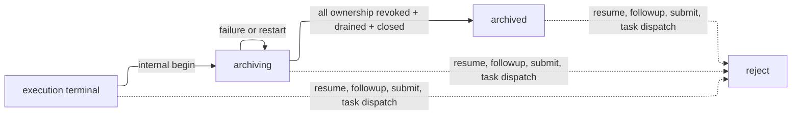

# Archive Session Lifecycle RUNBOOK

## Purpose

C 线从当前 `origin/main` 独立实现会议从 execution terminal 到 `archived` 的归档闭环。入口是已提交的 `end_meeting` terminal fact；归档由内部 coordinator 与启动恢复推进，不新增公开 archive tool、route、HTTP、Client、SQLite schema/migration、outbox kind、worker 或第二写入口。

## Current authority, scope and non-goals

- FR-8、FR-10、BR-7：归档只来自提交的完成/结束事实；不得继续讨论；只操作已证明的本 Meeting ownership；全部 meeting-owned Session 失权并关闭后才写 `archived`。
- `AGENT-MEETING-PROTOCOL-INTERFACE.md`：现有四阶段 `MeetingStatusResultV1`；`archiving` 有公开 package 且无 `archivedAt`，`archived` 有 `archivedAt`。
- `SQLITE-REPOSITORY-INTERFACE.md`：`repository.execute()` 的 `BEGIN IMMEDIATE` state/event/receipt/outbox 原子边界；`recordSessionOwnership()` 的不可变 identity、`active -> revoked` capability 与 `provisioning|active -> closed` lifecycle。
- `model.ts` 当前 `DomainEventTypes`：`meeting.archiving`、`meeting.archived`、`archive.sessions_closed` 已登记。
- `@deepseek-ai/dsh-subagent@0.1.1-rc.2`：`listChildren` 只读枚举 durable direct children；`interrupt` 只发起取消；`drainContinuableChildren` 成功返回是具名 resident direct-child Activation 已释放的唯一公开边界。

Scope 是 package 物化、capability revoke、interrupt/drain、ownership close、archive finalize、重启恢复、状态 projection、测试、独立 profile smoke 与 readiness evidence。

不包含 Mail、MeetingTask 新语义、task evidence、主持策略、续会创建、物理删除 DSH Session、HTTP/Client surface、多 provider abstraction、通用 worker、第二 outbox、archive table 或 migration。归档字段 optional 与 issue status 透传的正式协议对齐已由 2026-08-28 执行授权覆盖。

## State, data and safety invariants



`ArchiveRecord` 固定为当前 `model.ts` 形状，不加字段：

```ts
interface ArchiveRecord {
  readonly package: ImmutableArchivePackage;
  readonly archivedAt?: number;
}
```

`ArchivePackage` 固定使用当前字段：`schemaVersion`、`meetingId`、`teamId`、`objectiveContract`、`finalSummary`、`artifactRefs`、`acceptedDecisions`、`proposals`、`completionFacts`、`agenda`、`issues`、`unresolvedQuestions`、`parkingLot`、`formalTranscript`、`participantProvenance`、`termination`、`endedAt`、`materializedAt`。物化只深复制已提交 MeetingState 白名单事实；不放私聊、hidden reasoning、DSH Session transcript/header、Session/capability ID、prompt、完整运行配置、provider 配置或凭据。

不保留 `archiveSemanticHash`：当前 `ArchiveRecord`、正式 projection、receipt consumer 和恢复输入均无该字段消费者；用它作假设性 cleanup 校验会引入无消费者状态。幂等只由现有 receipt 的稳定 request identity、command kind、caller binding 与 request hash 完成。

不定义 `ArchiveProgress` 或 cleanup record。进度唯一来自 `MeetingState.status/archive` 与每条 `session_ownership.capabilityStatus/lifecycleStatus`：

- `archiving + archive.package + revoked + active|provisioning`：等待 cleanup；
- `archiving + archive.package + revoked + closed`：该 ownership 已完成；
- `archived + archive.archivedAt + 全部 revoked+closed`：完成。

`closed` 的领域含义是该 ownership 的 capability 已持久 revoke 且 `drainContinuableChildren` 已 fulfilled；不表示 durable Session 删除、不可枚举或 DSH retention 清除。

expected ownership set 的输入是同一 recovered snapshot 的 `state.manager`、`state.participants`、`RecoveryResult.sessionOwnership` 与 Captain `parentSessionId`。精确 identity tuple 为 `(teamId, meetingId, parentSessionId, sessionId, sessionLabel, provider, role, participantId)`。集合必须恰有：一个 `role='manager'`、`participantId` 缺失的 Manager row，以及 state 每个 participant ID 各一个 `role='participant'` row；所有 row 的 parent 相同、等于 Captain；label 严格等于既有 `encodeMeetingSessionLabel` 结果。缺失、重复、额外、role/participant、team/meeting/parent/label/provider 不一致一律保持 `archiving`，不对该 row 发 DSH effect，不写 `closed`，不写 `archived`。

## Internal functions and DSH adapter

`plugin/src/runtime/archive.ts` 导出以下唯一实现面；它不被 tool、route 或 Client 调用。

```ts
type TerminationIdentity = string;

function materializeArchivePackage(
  state: MeetingState,
  materializedAt: number,
): ArchivePackage;

async function beginArchiveFromTermination(input: {
  repository: Pick<MeetingRepository, "execute">;
  terminationIdentity: TerminationIdentity;
  now: number;
}): Promise<CommittedResult<{ status: "archiving" }>>;

async function cleanupOwnedSessions(input: {
  repository: Pick<MeetingRepository, "recover" | "recordSessionOwnership">;
  parent: Agent;
  runtime: ArchiveSessionRuntime;
  meetingId: string;
  signal: AbortSignal;
  now: number;
}): Promise<void>;

async function finalizeArchive(input: {
  repository: Pick<MeetingRepository, "recover" | "execute">;
  terminationIdentity: TerminationIdentity;
  now: number;
}): Promise<CommittedResult<{ status: "archived" }>>;

async function recoverArchive(input: {
  repository: Pick<
    MeetingRepository,
    "recover" | "execute" | "recordSessionOwnership"
  >;
  parent?: Agent;
  runtime?: ArchiveSessionRuntime;
  signal: AbortSignal;
  now: number;
}): Promise<void>;
```

`terminationIdentity` 是 SHA-256 of canonical JSON `{meetingId, termination}`。它从 terminal MeetingState 或 `archive.package.termination` 重算，重启和 finalize 不读取 receipt 查询接口。派生值固定为：

```ts
const requestId = `internal:archive:${terminationIdentity}`;
const callerBinding = `internal:termination:${terminationIdentity}`;
const capabilityId = `internal:termination:${terminationIdentity}`;
const beginCommandKind = "internal_archive_begin";
const finalizeCommandKind = "internal_archive_finalize";
const beginRequestHash = canonicalJson({
  terminationIdentity,
  operation: "begin",
});
const finalizeRequestHash = canonicalJson({
  terminationIdentity,
  operation: "finalize",
});
```

MeetingRuntime 的 `RepositoryAuthorizationValidator.validateCommand` 为这两个 internal command kind 验证 `callerBinding`、`capabilityId`、terminal 或 archive state 与 state termination 均匹配该 identity；它不解析或伪造 Captain caller。其余 command 继续走当前 caller/capability 验证。

`ArchiveSessionRuntime` 是 `session-adapter.ts` 的窄扩展，不新建 provider abstraction：

```ts
interface ArchiveSessionRuntime extends ContinuableLifecycleRuntime {
  listChildren(
    parentSessionId: SessionId,
    signal: AbortSignal,
  ): Promise<SubagentListEntry[]>;
}

function proveArchiveOwnedChildren(input: {
  runtime: Pick<ArchiveSessionRuntime, "listChildren">;
  parentSessionId: SessionId;
  meetingId: string;
  expected: readonly SessionOwnership[];
  signal: AbortSignal;
}): Promise<readonly SessionOwnership[]>;

function interruptAndDrainOwnedSessions(input: {
  runtime: ContinuableLifecycleRuntime;
  parent: Agent;
  ownerships: readonly MeetingOwnershipRecord[];
}): Promise<void>;
```

`proveArchiveOwnedChildren` 只在 effect 前和恢复时调用 `listChildren(parentSessionId, signal)`：每个 expected ID 必须为 `kind='child'`、`mode='continuable'`、label 与 direct parent 匹配；diagnostic、missing、unowned direct child 或 mismatch 失败。`listDescendants` 只记录异常诊断，绝不扩充目标。

`interruptAndDrainOwnedSessions` 复用现有函数：按已证明 session ID 逐个 `interrupt(id, { kind: 'ancestor', agent: parent })`，不等待；随后一次 `await drainContinuableChildren(parent, childIds)`。drain fulfilled 后不调用 residency query，也不要求 child 消失。post-drain 只把 effect 前 proof tuple 与当前 SQLite ownership tuple 对账，要求 capability 仍为 `revoked` 和 tuple 未漂移；durable child 仍能被 `listChildren` 枚举是成功路径。

## Transactions, side effects and recovery

1. `end_meeting` 已提交：现有 `endMeeting()` transaction 写 terminal MeetingState、`meeting.ended`、receipt，并由 `endMeeting()` 内现有 `cancelNonTerminalMeetingTasks(ended.state, now)` 保留 completed task、取消非终态 task。C 不等待 B。
2. `beginArchiveFromTermination` 调用一次 `repository.execute()`：expected version 是 terminal version；`transitionMeeting(state, 'archiving', { now, archive: { package } })` 写 package；events 只使用 transition 返回的现有 `meeting.archiving` 与现有 terminal cleanup events；outbox 为空；写 receipt。失败回滚且没有 DSH effect。receipt hit 返回原 result。
3. `cleanupOwnedSessions` 先 `repository.recover()`，只在 `archiving` 运行。构造 expected set，调用 `proveArchiveOwnedChildren`。失败停止在 `archiving`。
4. 每个 expected row 使用现有 `repository.recordSessionOwnership({ ...row, capabilityStatus: 'revoked' }, now)` 独立 `BEGIN IMMEDIATE` 持久 revoke；已经 revoked row 原样重放。全部 target revoke 提交后才发 DSH effect。
5. 调用现有 `interruptAndDrainOwnedSessions`。`interrupt` 返回或缺失 target no-op 不构成 close；只有 `drainContinuableChildren` fulfilled 才进入下一步。rejected/timeout 保持 revoked 和 `archiving`。
6. 再次 `repository.recover()`，用 effect 前 proof tuple 与恢复 ownership 对账。tuple 漂移、capability 非 revoked、expected set 不完整均停止。每条通过 row 用现有 `repository.recordSessionOwnership({ ...row, capabilityStatus: 'revoked', lifecycleStatus: 'closed' }, now)` 写 close。没有 DomainEvent、outbox 或 receipt。
7. `finalizeArchive` 再次 `repository.recover()`；只接受 `archiving`、immutable package、同一 termination identity、完整 expected set 全部 `revoked+closed`。一次 `repository.execute()` 调用 `transitionMeeting(state, 'archived', { now, archive: { archivedAt: now } })`，events 是现有 `meeting.archived` 加现有 `archive.sessions_closed`，outbox 为空，receipt 由 `operation: 'finalize'` request hash 写入。其它状态不写 archived。
8. `recoverArchive` 在插件启动对单 Meeting `recover()`；terminal 调 begin，archiving 调 cleanup 后 finalize，archived 只读。parent 或 runtime 缺失时，terminal 仍可完成 begin，archiving 保持可读业务状态并按既有 recovery-not-ready 返回 `503 + Retry-After`，不执行 cleanup/close/finalize。每次 crash 后重复 2--7；package 不再物化，已 revoke/closed row 同值重放，DSH effect 只重试已 proof 且未 close row。

进入 terminal 和 `archiving` 的 runtime guard 位于 `transitions.ts` 的 `endMeeting()`/`cancelNonTerminalMeetingTasks()`，以及 `tools/meeting-runtime.ts` 的 `dispatchInitialDelivery()`、`dispatchManagerPlanningDelivery()`、`dispatchMeetingTaskDelivery()` 和 `ensureWorker()` dispatch callback 的 pre-read/post-read。`runtime/outbox-worker.ts` 只完成既有 lease 状态，不写领域事实。迟到 start/finish/raise/submit 和 leased delivery completion 不写 task、raise、transcript、decision、completion fact、event、receipt 或新 outbox fact。

## Files and ownership

| Path                                                         | Symbol                                                                      | Change                                                                                               | Reason                         |
| ------------------------------------------------------------ | --------------------------------------------------------------------------- | ---------------------------------------------------------------------------------------------------- | ------------------------------ |
| `plugin/src/runtime/archive.ts`                              | five functions above                                                        | New internal coordinator/materializer/recovery                                                       | terminal-to-archive lifecycle  |
| `plugin/src/domain/transitions.ts`                           | archive transition result                                                   | Add `archive.sessions_closed` only to finalize result; retain `meeting.archiving`/`meeting.archived` | registered event sequence      |
| `plugin/src/dsh/session-adapter.ts`                          | `ArchiveSessionRuntime`, `proveArchiveOwnedChildren`, existing drain helper | Add direct-child proof using rc.2 `listChildren`                                                     | exact ownership proof          |
| `plugin/src/repository/index.ts`                             | `recordSessionOwnership` call sites only                                    | Reuse existing revoke/close method; no schema change                                                 | durable progress               |
| `plugin/src/runtime/recovery.ts`                             | `recoverArchive` startup call                                               | Invoke internal recovery for terminal/archiving                                                      | restart convergence            |
| `plugin/src/tools/meeting-runtime.ts`                        | authorization validator and dispatch guards                                 | Validate internal termination binding; retain latest-state task/outbox guards                        | no public caller or late fact  |
| `plugin/src/runtime/outbox-worker.ts`                        | existing `runOnce()`                                                        | No change; it only completes leases                                                                  | no second outbox behavior      |
| `plugin/src/projection/status.ts`                            | existing `archiving`/`archived` branch                                      | No functional change; add contract fixture only                                                      | existing four-phase read model |
| `plugin/src/index.ts`                                        | startup wiring                                                              | Start recovery coordinator                                                                           | plugin lifecycle               |
| `plugin/tests/unit/runtime/archive.spec.ts`                  | archive unit cases                                                          | New                                                                                                  | materialize/identity/order     |
| `plugin/tests/integration/runtime/archive-lifecycle.spec.ts` | lifecycle cases                                                             | New                                                                                                  | repository/runtime effects     |
| `plugin/tests/recovery/archive-recovery.spec.ts`             | crash cases                                                                 | New                                                                                                  | restart idempotence            |
| `plugin/tests/integration/dsh/archive-profile.spec.ts`       | profile assertions                                                          | New                                                                                                  | rc.2 lifecycle proof           |
| `docs/40-readiness/ARCHIVE-SESSION-LIFECYCLE-EVIDENCE.md`    | evidence                                                                    | New at completion                                                                                    | verification record            |

Do not change HTTP/Client, task evidence, public protocol routes, `plugin/src/protocol/*`, `plugin/src/repository/schema.ts`, or `plugin/src/repository/migrations.ts`.

## Implementation and test plan

| Step | Input and files                                                     | Output                                             | Narrow test and completion criterion                                                                                                                                                     |
| ---- | ------------------------------------------------------------------- | -------------------------------------------------- | ---------------------------------------------------------------------------------------------------------------------------------------------------------------------------------------- |
| T1   | terminal MeetingState; `runtime/archive.ts`                         | `materializeArchivePackage`                        | `tests/unit/runtime/archive.spec.ts`: exact whitelist deep copy and privacy exclusions                                                                                                   |
| T2   | state participants, manager, ownership rows; `runtime/archive.ts`   | expected identity set                              | same test: missing/duplicate/extra/wrong role/participant/label/provider/team/meeting/parent fail                                                                                        |
| T3   | terminal snapshot; `runtime/archive.ts`, `tools/meeting-runtime.ts` | internal derived request identity and begin commit | `tests/integration/runtime/archive-lifecycle.spec.ts`: one `meeting.archiving`, immutable package, receipt replay                                                                        |
| T4   | proven direct children; `dsh/session-adapter.ts`                    | list proof then revoke/interrupt/drain             | `tests/unit/runtime/archive.spec.ts`: wrong parent/team/label and diagnostic produce zero effect; fake call order is revoke → interrupt → drain                                          |
| T5   | drain fulfilled/rejected; `runtime/archive.ts`                      | close or archiving retry                           | `tests/integration/runtime/archive-lifecycle.spec.ts`: fulfilled + SQLite revoke writes closed; rejected writes no closed                                                                |
| T6   | durable child survives drain; adapter/runtime tests                 | closed without deletion claim                      | `tests/integration/runtime/archive-lifecycle.spec.ts`: child remains listed, capability revoked, followup/dispatch/resume rejected                                                       |
| T7   | each boundary crash; `runtime/archive.ts`, `runtime/recovery.ts`    | idempotent recovery                                | `tests/recovery/archive-recovery.spec.ts`: before/after begin, each revoke, interrupt, drain, inspection, close, finalize; no rematerialize or premature archived                        |
| T8   | terminal/task/outbox races; transitions/tools/outbox worker         | zero late facts                                    | `tests/integration/runtime/archive-lifecycle.spec.ts` plus `tests/unit/runtime/outbox-worker.spec.ts`: completed task retained, non-terminal cancelled, late delivery has no domain fact |
| T9   | archiving/archived state fixtures; `projection/status.ts`           | four-phase projection                              | `tests/contract/status-projection.spec.ts`: `pauseControl.action='none'`, no running fields, archiving package/no `archivedAt`, archived `archivedAt`, only recovery-not-ready is 503    |
| T10  | scratch profile and restart; DSH integration test                   | real lifecycle evidence                            | `tests/integration/dsh/archive-profile.spec.ts`: drain resident activation, ownership closed, durable child remains listable, no meeting participation after restart                     |
| T11  | all passed tests; readiness document                                | evidence and Not Covered                           | record commands, versions, output, profile configuration and Not Covered                                                                                                                 |

Run T1--T11 from `plugin/`: `pnpm format:check`, `pnpm typecheck`, focused Vitest files, `pnpm test`, `pnpm build`, `pnpm verify:package`, `pnpm verify:environment`, `pnpm verify:contract`, then independent profile `dsh --profile <scratch> --dump-config` and the T10 smoke. The profile uses `@deepseek-ai/dsh-subagent-spawn-in-process@0.1.1-rc.2` provider `spawn`; it never requires Session deletion.

## Not Covered and closure

Not Covered: physical DSH Session deletion, cross-process residency coordination, external tool exactly-once, Mail, continuation creation, HTTP/Client, A/B unmerged changes, and any schema extension. These items do not enlarge this Scope.

C implements and verifies this RUNBOOK in one worktree from `origin/main`; A/B review only current invariants. The later merger rebases on already merged main, resolves actual shared-file conflicts, then reruns affected tests and the full verification list above. After readiness evidence exists and long-lived conclusions move to formal design/interface documents, delete this RUNBOOK in that closure change. No implementation, commit, push, or PR occurs in this design stage.
