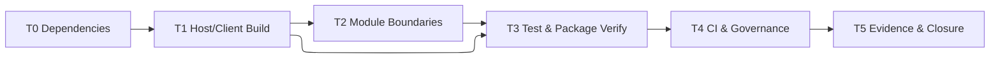

# RUNBOOK: Convivium 工程框架实现

状态：待执行  
适用范围：`plugin/` 工程框架与仓库 CI  
关闭规则：目标完成并将验证事实迁入 `docs/40-readiness/` 后删除本文

## 1. Purpose

本文用于执行 Convivium 首个工程框架实现，目标是在不实现会议业务行为的前提下，把当前最小 Host 骨架升级为符合 [Convivium Implementation Design](./CONVIVIUM-IMPLEMENTATION-DESIGN.md) 的可开发、可测试、可构建、可由 CI 验证的 DSH Host/Client 双面插件。

本 RUNBOOK 只规定本次执行顺序、文件落点、框架接口、验证和恢复方式。会议状态机、协议字段、SQLite DDL、DSH Session 行为和前端产品功能仍分别以 Requirements、Interface、Meeting Design 和 Implementation Design 为准。

## 2. Scope And Non-goals

### 2.1 Scope

1. 将 `plugin/` 校准为单 package、Host/Client 双入口的 DSH bundle。
2. 补齐框架编译和后续实现所需的 DSH peer/dev dependencies。
3. 建立 TypeScript 声明构建、Host bundle、Client bundle 和 package contract 验证。
4. 建立 Vitest 的 Host、Client 和 package contract 测试入口。
5. 建立 Implementation Design 规定的空模块结构和依赖边界。
6. 更新 PR CI，使治理、插件类型检查、测试、构建和 package contract 成为独立可见检查。
7. 形成可重复验证结果和清晰的 commit 边界。

### 2.2 Non-goals

- 不实现 Meeting、Participant、Turn、SpeakerAttempt 或完成判断。
- 不创建正式 SQLite schema、migration 或 repository transaction。
- 不注册任何 `convivium_*` 模型工具或正式 HTTP route。
- 不创建、followup、interrupt 或 drain DSH AgentSession。
- 不实现真实会议 UI、polling、暂停或继续操作。
- 不决定 npm、tarball 或 Git dependency 中哪一种是最终分发方式。
- 不以 placeholder 返回虚假成功，不为尚未实现的业务接口提供可调用 stub。

## 3. Authority And Preconditions

### 3.1 Authority

- 仓库边界：[Architecture](../00-governance/ARCHITECTURE.md)
- 提交规则：[Commit Rules](../00-governance/COMMIT-RULES.md)
- PR 与 CI：[PR Rules](../00-governance/PR-RULES.md)
- 产品需求：[Meeting Orchestration Requirements](../10-requirements/MEETING-ORCHESTRATION-REQUIREMENTS.md)
- 跨边界契约：[Agent Meeting Protocol Interface](../20-interfaces/AGENT-MEETING-PROTOCOL-INTERFACE.md)
- 领域设计：[Meeting Orchestration Design](./MEETING-ORCHESTRATION-DESIGN.md)
- 源码落点：[Convivium Implementation Design](./CONVIVIUM-IMPLEMENTATION-DESIGN.md)

发生冲突时，按治理文档定义的优先级处理；RUNBOOK 不得覆盖 Requirements、Interface 或稳定 Design。

### 3.2 Preconditions

执行前必须满足：

- 当前分支不是 `main`。
- 工作区没有归属不明的改动；若存在，先隔离或停止。
- `node --version` 满足 `^22.19.0 || >=24`。
- `pnpm --version` 可用。
- `plugin/package.json`、`plugin/cordis.patch.yml` 和 `plugin/src/index.ts` 存在。
- DSH 最低目标版本固定为 `0.1.1-rc.1`。
- 不读取或复制外部参考项目源码；DSH 接口只从官方 `deepseek-harness` 源码、已安装 package metadata 和公开类型取证。

执行前记录：

```sh
git status --short --branch
node --version
pnpm --version
pnpm --dir plugin verify
```

## 4. Target Package Contract

### 4.1 Product tree

本次任务完成后必须存在以下结构；没有行为的目录用边界 `index.ts` 建立，不使用 `.gitkeep`：

```text
plugin/
├── package.json
├── pnpm-lock.yaml
├── cordis.patch.yml
├── tsconfig.json
├── tsconfig.client.json
├── tsdown.config.ts
├── vitest.config.ts
├── src/
│   ├── index.ts
│   ├── config.ts
│   ├── protocol/
│   │   └── index.ts
│   ├── domain/
│   │   └── index.ts
│   ├── repository/
│   │   └── index.ts
│   ├── runtime/
│   │   └── index.ts
│   ├── dsh/
│   │   └── index.ts
│   ├── tools/
│   │   └── index.ts
│   ├── http/
│   │   └── index.ts
│   ├── projection/
│   │   └── index.ts
│   └── client/
│       └── index.tsx
├── tests/
│   ├── unit/
│   │   └── module-boundaries.spec.ts
│   ├── contract/
│   │   └── package-contract.spec.ts
│   └── client/
│       └── client-entry.client.spec.ts
└── scripts/
    └── verify-package.mjs
```

`src/protocol/` 是 Host 与 Client 都可依赖的 transport-neutral 类型边界，只允许纯 TypeScript 类型、常量和无副作用 codec；不得导入 Node.js、React、DSH service 或数据库模块。正式协议结构将在后续任务按 Interface 落入该目录。本次只建立边界，不复制 Interface 中的全部字段。

### 4.2 Published artifacts

```ts
interface PackageArtifactContract {
  hostJavaScript: 'lib/index.js'
  hostTypes: 'lib/types/index.d.ts'
  clientJavaScript: 'lib/client.js'
  clientTypes: 'lib/types/client/index.d.ts'
  bundlePatch: 'cordis.patch.yml'
}
```

`package.json` 必须满足：

```ts
interface DshBundleManifestV1 {
  bundle: {
    patch: './cordis.patch.yml'
  }
  client: {
    platform: 'web'
    inject: readonly string[]
  }
}
```

必须导出：

```text
.
./client
./cordis.patch.yml
./package.json
```

`files` allowlist 只能包含：

```text
lib
cordis.patch.yml
README.md
```

未来新增正式资产时再显式加入；不得用 `src`、`tests` 或通配整个仓库绕过发布边界。

### 4.3 Host and Client entry contracts

Host entry 只完成插件组合：

```ts
import type { Context } from '@deepseek-ai/cordis'
import z from '@deepseek-ai/schemastery'

export interface Config {}

export const name: 'convivium'
export const inject: readonly string[]
export const Config: z<Config>
export function apply(ctx: Context, config: Config): void
```

框架阶段的 `apply()` 可以不注册业务能力，但必须保留正确的 disposer 所有权模式，不得输出“会议已可用”的日志或注册假工具。

Client entry 是独立 browser plugin：

```ts
import type { Context } from '@deepseek-ai/cordis'

export const name: 'convivium-client'
export const inject: readonly string[]
export function apply(ctx: Context): void
```

框架阶段 Client `apply()` 不渲染会议 UI；它只能证明 Client bundle 可被 DSH browser roster 解析和激活。不得导入 Host entry 或任何 `repository/`、`runtime/`、`dsh/`、`tools/`、`http/` 模块。

### 4.4 Module boundary contract

```ts
type ModuleName =
  | 'protocol'
  | 'domain'
  | 'repository'
  | 'runtime'
  | 'dsh'
  | 'tools'
  | 'http'
  | 'projection'
  | 'client'

interface ModuleBoundary {
  name: ModuleName
  mayImport: readonly ModuleName[]
  forbiddenRuntimeImports: readonly string[]
}
```

边界矩阵：

| Module | May import | Must not import |
|---|---|---|
| `protocol` | none | DSH services、Node.js、React、SQLite |
| `domain` | none | protocol transport、DSH、HTTP、React、SQLite、文件系统 |
| `repository` | `domain` | DSH、React、HTTP transport |
| `dsh` | `domain` | repository implementation、React |
| `projection` | `protocol`、`domain` | DSH mutation APIs、React |
| `runtime` | `domain`、repository ports、DSH ports、projection | React、HTTP handler |
| `tools` | `protocol`、`runtime` | repository implementation、Client |
| `http` | `protocol`、`runtime` | repository implementation、Client |
| `client` | `protocol` | Host entry、Node.js、SQLite、其他 Host module |

本次通过静态测试检查明显越界 import。后续引入 lint boundary rule 时替代自定义扫描，但不得保留两套冲突规则。

## 5. Dependency Contract

### 5.1 Runtime peers

最低 DSH train 统一为 `^0.1.1-rc.1`。本次 package manifest 至少声明以下直接边界：

| Package | Face | Reason |
|---|---|---|
| `@deepseek-ai/cordis` | shared | Host/Client plugin context identity |
| `@deepseek-ai/dsh-agent` | Host | caller Agent 类型与真实 caller 绑定 |
| `@deepseek-ai/dsh-session` | Host | Session identity 和生命周期类型 |
| `@deepseek-ai/dsh-subagent` | Host | continuable child Session API |
| `@deepseek-ai/dsh-system-prompt` | Host | system prompt contribution |
| `@deepseek-ai/dsh-tools` | Host | `convivium_*` tool registration |
| `@deepseek-ai/dsh-workspace` | Host | workspace 到 Meeting 路径定位 |
| `@deepseek-ai/dsh-host-webserver` | Host | `/api/convivium/*` route registration |
| `@deepseek-ai/dsh-client-runtime` | Client | browser plugin runtime |
| `@deepseek-ai/dsh-client-locale` | Client | UI locale contribution |
| `@deepseek-ai/dsh-client-ui-layout` | Client | shell layout surface |
| `@deepseek-ai/dsh-client-ui-conversation` | Client | conversation/session UI integration |
| `@deepseek-ai/dsh-client-ui-primitives` | Client | shared UI primitives |
| `@deepseek-ai/dsh-client-ui-slots` | Client | typed slot contribution |
| `react`、`react-dom` | Client | shared browser rendering identity |

上述包作为 peer 表达 Host/Profile 提供的共享 runtime identity；在 `devDependencies` 中使用可重复编译和测试的具体兼容版本。`peerDependenciesMeta.optional = true` 只用于阻止 package manager 在独立 checkout 中自行拼装完整 DSH runtime，不表示插件运行时可缺少相应 service。真正的必需能力由 Host `inject` 和启动期 capability check 约束。

### 5.2 Ordinary dependencies

- `@deepseek-ai/schemastery` 是插件内部 Schema 库，使用普通 dependency；不得同时声明成 optional peer。
- `node:sqlite`、`node:fs`、`node:path` 等 Node.js builtin 不进入 dependencies。
- 框架任务不得添加 SQLite 第三方 driver、状态机框架或通用工作流框架。

### 5.3 Development dependencies

至少包含：

```ts
interface FrameworkDevToolchain {
  typescript: string
  tsdown: string
  vitest: string
  jsdom: string
  '@testing-library/react': string
  '@types/node': string
  '@types/react': string
  '@types/react-dom': string
}
```

版本选择规则：

1. DSH packages 使用 `0.1.1-rc.1` 进行开发锁定，peer range 使用 `^0.1.1-rc.1`。
2. React 使用 DSH Web Client 同一主版本 `18`。
3. TypeScript、tsdown、Vitest 和 jsdom 选择当前 lockfile 可解析、支持 Node 22.19+ 的版本并写入 lockfile。
4. 不使用 `workspace:` specifier；Convivium 必须在没有相邻 DSH checkout 时安装。

## 6. Build And Test Interfaces

### 6.1 TypeScript faces

`tsconfig.json`：

- Host target 为 Node 22.19+。
- 生成声明到 `lib/types`。
- 排除 `src/client/**` 和 `tests/**`。
- 允许 Host 引用 `protocol`、`domain` 和其他 Host modules。

`tsconfig.client.json`：

- 只包含 `src/client/**` 和 Client 所需的 `src/protocol/**`。
- 包含 DOM libs，不包含 Node.js types。
- 生成 Client 声明到 `lib/types/client`。
- 任一 Node builtin import 必须使 Client typecheck 或 package contract 失败。

测试使用独立的 Vitest TypeScript 转换，不把测试声明发布进 `lib/types`。

### 6.2 Bundle build

`tsdown.config.ts` 输出两个 artifact：

```ts
interface BuildEntry {
  input: string
  output: string
  platform: 'node' | 'browser'
  target: 'node22.19.0' | 'es2022'
}

const entries: readonly BuildEntry[] = [
  { input: 'lib/types/index.js', output: 'lib/index.js', platform: 'node', target: 'node22.19.0' },
  { input: 'lib/types/client/index.js', output: 'lib/client.js', platform: 'browser', target: 'es2022' },
]
```

具体 tsdown API 以所安装版本为准，但产物契约不能改变。Client bundle 必须 externalize DSH browser roster 提供的共享模块，不得内联第二份 Cordis、React 或 DSH Client runtime。

### 6.3 Package scripts

完成后 `package.json` 至少提供：

```json
{
  "scripts": {
    "typecheck": "...host... && ...client...",
    "test": "vitest run",
    "test:integration": "vitest run tests/integration --passWithNoTests",
    "test:recovery": "vitest run tests/recovery --passWithNoTests",
    "test:stress": "vitest run tests/stress --passWithNoTests",
    "build": "...declarations... && tsdown",
    "verify:package": "node scripts/verify-package.mjs",
    "verify": "pnpm typecheck && pnpm test && pnpm build && pnpm verify:package"
  }
}
```

框架阶段 `tests/integration`、`tests/recovery` 和 `tests/stress` 尚无业务测试时，命令必须成功报告“零用例/未覆盖”，不能伪造通过的业务测试。若 Vitest 对空目录返回失败，使用一个显式的 test manifest 检查目录存在与状态，而不是加入永远成功的假测试。

### 6.4 Package verifier

```ts
interface PackageVerificationResult {
  exportsMatchArtifacts: boolean
  filesAllowlistIsClosed: boolean
  bundlePatchMatchesPackageName: boolean
  clientManifestIsComplete: boolean
  forbiddenPublishedPaths: string[]
  missingArtifacts: string[]
}
```

`scripts/verify-package.mjs` 必须从磁盘读取真实 `package.json`、patch 和产物，不复制一份期望 manifest。任一 boolean 为 false 或任一数组非空时以非零退出。

### 6.5 Framework tests

| Test | Assert | Not asserted |
|---|---|---|
| `module-boundaries.spec.ts` | Client 无 Host import；domain 无 infrastructure import | 会议状态机正确性 |
| `package-contract.spec.ts` | manifest、patch、exports 和 allowlist 一致 | DSH profile 真正启动 |
| `client-entry.client.spec.ts` | Client entry 可在 browser-compatible 环境加载和 dispose | 会议 UI 行为 |

测试名称和输出必须使用“framework/package/client entry”，不得出现“meeting works”“recovery passed”等超出覆盖范围的声明。

## 7. CI Contract

`.github/workflows/pr-verify.yml` 保留 Governance job，并新增彼此独立可见的检查：

```ts
interface CiJobContract {
  name: 'Governance' | 'Plugin Typecheck' | 'Plugin Test' | 'Plugin Build' | 'Package Contract'
  workingDirectory: 'repository-root' | 'plugin'
  command: string
}
```

| Job | Working directory | Command |
|---|---|---|
| `Governance` | root | 现有治理结构和 `git diff --check` |
| `Plugin Typecheck` | `plugin` | `pnpm typecheck` |
| `Plugin Test` | `plugin` | `pnpm test` |
| `Plugin Build` | `plugin` | `pnpm build` |
| `Package Contract` | `plugin` | `pnpm verify:package`，必须依赖 Build artifact |

每个插件 job 必须：

1. checkout repository；
2. setup Node 22.19+；
3. setup 与 lockfile 兼容的 pnpm；
4. 在 `plugin/` 执行 `pnpm install --frozen-lockfile`；
5. 执行该 job 唯一公开检查。

允许通过 cache 或 artifact 减少重复安装/构建，但不能把所有检查隐藏回单一 `verify` job。`Package Contract` 可以下载 `Plugin Build` 产物，或在自身 job 重建；无论哪种方式都必须显式依赖成功的 build。

同步更新 `docs/00-governance/PR-RULES.md`：移除“CI 尚未执行插件检查”的临时口径，列出实际 job 名称和覆盖边界。若必过 Ruleset 仍只要求 Governance，在 PR/readiness 中记录该外部配置尚未同步，不能声称全部 job 已被分支保护强制。

## 8. Execution Plan

### T0 — Baseline and dependency proof

**Depends on:** none  
**Files:** `plugin/package.json`、`plugin/pnpm-lock.yaml`

Actions:

1. 记录当前 baseline 命令结果。
2. 按 §5 更新 dependency 分类和版本。
3. 执行 `pnpm install` 更新 lockfile。
4. 使用 `pnpm why` 确认 DSH、React、Cordis 未产生意外重复直接依赖。
5. 验证在没有相邻 DSH workspace resolution 的情况下可安装。

Success:

- frozen lockfile install 成功；
- 所有直接 import 都有 manifest 归属；
- package 不含 `workspace:`、本机绝对路径或 Git reference。

Failure and restore:

- 某个 `0.1.1-rc.1` package 不可解析时停止，不擅自降级最低 DSH 版本；记录 package 和 registry 证据。
- lockfile 更新失败时恢复 `package.json` 与 lockfile 到 T0 前状态，不进入 T1。

**Commit boundary:** `Build(plugin/dependencies): 固化 DSH 双面插件依赖基线`

### T1 — Host/Client build faces

**Depends on:** T0  
**Files:** `plugin/package.json`、`plugin/tsconfig*.json`、`plugin/tsdown.config.ts`、`plugin/src/index.ts`、`plugin/src/client/index.tsx`

Actions:

1. 实现 §4.2 和 §4.3 manifest/entry contract。
2. 分离 Host 与 Client typecheck。
3. 建立声明输出和 tsdown 双 bundle。
4. 确认 Client artifact 不含 Node builtin、SQLite 或 Host module。
5. 执行 dry package listing，确认只包含 allowlist 内容。

Success:

- `lib/index.js`、`lib/client.js` 和两组声明存在；
- 两个 entry 可分别 import；
- `cordis.patch.yml` row 与 package name 一致；
- 当前空框架不注册业务工具、路由或虚假 UI。

Failure and restore:

- Client 构建无法 externalize DSH runtime 时停止，先从官方 Client package config 取证；不得通过内联共享 runtime 绕过。
- 构建失败时保留 T0 dependency commit，回退 T1 未提交文件。

**Commit boundary:** `Build(plugin/bundle): 建立 Host 与 Client 双入口构建`

### T2 — Module skeleton and boundary tests

**Depends on:** T1  
**Files:** `plugin/src/{config,protocol,domain,repository,runtime,dsh,tools,http,projection,client}`、`plugin/tests/unit`

Actions:

1. 按 §4.1 建立目录和最小 barrel。
2. `config.ts` 只承载空 Config schema 与启动期 capability contract；入口不重复定义 Config。
3. 每个 module barrel 只导出已存在的类型或 `export {}`，不创建假 repository/runtime 实现。
4. 建立 boundary matrix 测试。
5. 检查循环依赖和 Client 越界 import。

Success:

- 目录能够被 Git 跟踪；
- `src/index.ts` 只组合模块；
- module boundary test 对人工插入的一个禁止 import 能失败，恢复后通过；
- 没有 `throw new Error("not implemented")` 暴露为可调用产品入口。

Failure and restore:

- 若边界需要改变 Implementation Design，先停止并更新稳定设计，不能只改测试白名单。

**Commit boundary:** `Refactor(plugin/structure): 建立会议模块依赖边界`

### T3 — Test and package verification entry

**Depends on:** T1、T2  
**Files:** `plugin/vitest.config.ts`、`plugin/tests/**`、`plugin/scripts/verify-package.mjs`、`plugin/package.json`

Actions:

1. 建立 Host、Client 和 contract test projects/environment。
2. 实现 §6.4 verifier。
3. 实现三个 framework tests。
4. 建立完整 package scripts。
5. 验证 package verifier 在缺失 `lib/client.js`、错误 patch name 和开放式 allowlist 三种注入故障下失败；每次测试后恢复文件。

Success:

- `pnpm typecheck`、`pnpm test`、`pnpm build`、`pnpm verify:package`、`pnpm verify` 全部通过；
- 故障注入证明 verifier 不是永远成功；
- 输出不声称覆盖会议业务。

Failure and restore:

- 故障注入必须使用临时副本或 `Prepare → Execute → Assert → Restore`；失败也必须恢复。
- 测试框架无法区分 Host/Client 时不得统一成带 Node globals 的 jsdom 环境。

**Commit boundary:** `Test(plugin/framework): 建立双面插件验证入口`

### T4 — CI and governance

**Depends on:** T3  
**Files:** `.github/workflows/pr-verify.yml`、`docs/00-governance/PR-RULES.md`

Actions:

1. 按 §7 增加独立 jobs。
2. 使用 frozen lockfile。
3. 明确 Build 与 Package Contract 的 artifact/依赖关系。
4. 更新 PR Rules 的实际检查名、覆盖和 Not Covered。
5. 本地检查 workflow YAML，并在 PR 上观察全部 jobs 至少运行一次。

Success:

- workflow 语法有效；
- 每个 job 名称稳定、目的单一；
- 改坏 typecheck/test/build/package contract 时对应 job 单独失败；
- Governance 仍保留且通过。

Failure and restore:

- GitHub Actions 权限、网络或 Ruleset 不可用时，代码与本地验证可以保留，但必须在 readiness `Not Covered` 记录远端未验证，不得宣称 CI 完成。

**Commit boundary:** `CI(repo/pr): 建立插件工程验证矩阵`

### T5 — Closure evidence

**Depends on:** T0–T4  
**Files:** `docs/40-readiness/CONVIVIUM-FRAMEWORK-EVIDENCE.md`、本文、必要时 `TODO.md`

Actions:

1. 记录 commit 边界、Node/pnpm 版本、执行命令和结果。
2. 记录未覆盖的会议业务、真实 Session、SQLite、恢复和 UI 行为。
3. 检查所有长期工程判断已进入 Implementation Design、PR Rules 或源码配置。
4. 删除已完成 TODO；若部分完成，只保留真实剩余任务。
5. 删除本 RUNBOOK；不得把执行历史留在 `docs/30-designs/`。

Success:

- readiness evidence 满足 Document Rules；
- RUNBOOK 和已完成 TODO 不出现在关闭 commit 后的 HEAD；
- 工作区干净，最终 diff 不含临时 profile、构建产物、绝对路径或凭据。

**Commit boundary:** `Docs(repo/readiness): 记录插件工程框架验证结论`；该提交必须同时包含验证证据和 RUNBOOK 清理，不得仅删除文件。

## 9. Execution Graph



串行约束：T0 与 T1 不得并行；T3 必须消费 T1 的真实 artifacts 和 T2 的真实 boundaries；T4 不得在本地命令尚未稳定前先写 CI。

可并行验证：T3 完成后，Host unit、Client test 和 package verifier 可以并行运行，但其结果必须分别报告。

## 10. Global Verification

### Prepare

```sh
git status --short --branch
node --version
pnpm --version
pnpm --dir plugin install --frozen-lockfile
```

### Execute

```sh
pnpm --dir plugin typecheck
pnpm --dir plugin test
pnpm --dir plugin build
pnpm --dir plugin verify:package
pnpm --dir plugin verify
git diff --check
```

### Assert

- 所有命令退出码为 0。
- `git status --short` 不包含 `plugin/lib/`、`plugin/node_modules/`、临时 profile 或测试数据库。
- package listing 不包含 `src/`、`tests/`、本机路径或仓库文档。
- Client bundle 不包含 Node builtin import。
- CI workflow 中五类检查均为独立 step/job 可见。
- 测试报告明确仅覆盖 framework，而非会议业务。

### Restore

- 删除验证创建的临时 DSH profile、tarball、测试数据库和临时目录。
- 不删除用户已有 profile；临时 profile 必须从一开始使用任务专属路径。
- 失败时恢复故障注入文件，保留失败输出供 readiness 记录。
- 不使用 `git reset --hard`、`git checkout --` 或递归删除不明确路径。

## 11. Completion Criteria

只有同时满足以下条件，才可以关闭本 RUNBOOK：

1. 当前 plugin 是 manifest 完整的 DSH bundle，并具有可解析的 Host/Client 双入口。
2. 依赖分类、版本和 lockfile 可在独立 checkout 中重复安装。
3. Implementation Design 的模块目录均有可跟踪边界，且没有业务假实现。
4. Host、Client 和 package contract 测试入口真实有效，至少一个故障注入证明每类 gate 能失败。
5. PR CI 显式运行 Governance、Plugin Typecheck、Plugin Test、Plugin Build 和 Package Contract。
6. `pnpm --dir plugin verify` 与 `git diff --check` 通过。
7. readiness evidence 明确列出尚未覆盖的会议、SQLite、DSH Session、恢复、压力和 UI 行为。
8. 长期结论已迁移，本 RUNBOOK 和完成的 TODO 已从最终提交删除。
